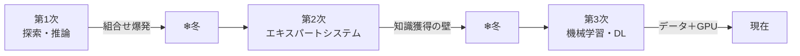

# ① AIの歴史・動向

> 計画 6/24。配点は軽いが、**「何を実現し、なぜ行き詰まり、何が突破口になったか」**を因果で押さえると、後続章（ML/DL）の必然性まで見える。年号は前後関係と代表例をセットで。
> ※ 末尾の【出典】で主要な事実を一次情報・公的資料に照合済み。

## 全体像：パラダイムの3段階
AIの歴史は「知能をどう実装するか」のパラダイム転換史。**探索・推論 →（人間が）知識を記述 →（機械が）データから学習**、と主役が移ってきた。各転換は前の限界への回答になっている。第2次→第3次は **「ルールからデータへ」** のシフトと言われる。

---

## 第1次ブーム（1950s–60s）：探索と推論
**記号と明示的ルールで推論する**時代（記号主義／GOFAI）。問題を状態空間のグラフとして表し、**探索**（幅優先・深さ優先、評価関数で枝刈りする**ヒューリスティック探索**）で迷路・パズル・定理証明・ゲームを解いた。出発点は**1956年のダートマス会議**で、**ジョン・マッカーシー**が "Artificial Intelligence" という語を提案した（ミンスキー、シャノンらも参加）。

行き詰まりの本質は**組合せ爆発**——手数が増えると探索空間が指数的に膨らみ計算が破綻する。解けたのはルールが完全に定義された**トイ・プロブレム**だけで、曖昧で例外だらけの現実問題には通用せず、冬を迎えた。

### ニューラルネットの最初の波と挫折
同時期、**1958年にローゼンブラットが「パーセプトロン」**を提案（脳神経を模した学習機械として注目）。しかし**1969年、ミンスキーとパパート**が、単層パーセプトロンは**線形分離可能な問題しか解けず、XOR が解けない**ことを示し、NN研究は一旦冬に入る。この限界は後に**多層化＋誤差逆伝播**で解かれる。

## 第2次ブーム（1980s）：知識を詰め込む
「現実が解けないのは知識が足りないからだ」という反省から、**専門家の知識を if-then ルール化した**エキスパートシステムが主役に。代表例：
- **DENDRAL**（1965〜、ファイゲンバウム）：世界初級のエキスパートシステム。質量分析データから有機化合物の構造を推定する化学特化システム。ファイゲンバウムは「エキスパートシステムの父」。
- **MYCIN**（1972）：細菌感染症の診断・抗生物質を推奨。正答率は約65%で、専門医には及ばないが実用可能性を示した代表例。
- 日本でも**1982年に「第五世代コンピュータ」プロジェクト**（約570億円）が発足。

しかし**知識獲得のボトルネック**で再び失速する。専門家の暗黙知を漏れなくルール化するのは膨大で、例外・常識・矛盾の維持が破綻した（世界の常識を書き出そうとした**Cyc**プロジェクトが象徴）。1990年代半ばに冬入り。

## 第3次ブーム（2000s–現在）：データから学ぶ
発想を逆転させ、**人間がルールを書くのをやめ、データから機械自身に法則を学ばせる**機械学習が主役に。NN側では**1986年にラメルハートらが誤差逆伝播法**を広め、多層パーセプトロンの学習が可能になっていた。これが計算資源とデータの充実で開花する。

冬が来ない理由は技術的条件が揃ったから——**ビッグデータ**（Web由来の大量データ）、**GPU**の並列計算力、**誤差逆伝播＋深層化のノウハウ**の三位一体。

| 年 | 出来事 |
|---|---|
| 2012 | **AlexNet**（クリジェフスキー、サツケバー、ヒントン／トロント大）がILSVRCで圧勝 → 第3次点火 |
| 2014 | **GAN**（グッドフェロー） |
| 2016 | **AlphaGo**（DeepMind）がトップ棋士に勝利 |
| 2017 | **Transformer**（Google、自己注意でRNNの逐次処理を脱却） |
| 2022– | **ChatGPT** などLLMが一般普及 |

---

## 古典AIが突きつけた「難問」（定義と提唱者を正確に）
- **フレーム問題**（マッカーシー&ヘイズ提起、デネットの例示）：行動に際し「何が変化し／しないか、何を考慮すべきか」を有限時間で切り分けられない。
- **シンボルグラウンディング問題**（ハルナド）：記号「りんご」が実世界の意味に**接地**していない。身体性の議論につながる。
- **中国語の部屋**（サール）：マニュアル通りの記号操作は外から理解しているように見えても本人は意味を解さない＝**統語は意味理解を含意しない**。意識を持つ「強いAI」批判。
- **強いAI / 弱いAI**：強い＝意識・理解を持つAI、弱い＝道具としての知能。現存は全て弱いAI。
- **チューリングテスト**（チューリング, 1950）：知能を内部構造でなく**振る舞いの区別不可能性**で操作的に定義（イミテーションゲーム）。

## レベル分類（マーケ文脈で問われる）
1. 単純な制御　2. 古典的AI（探索・知識ベース）　3. 機械学習　4. 表現学習（DL）

---

📝 **確認**：第1〜3次の「実現したこと・冬の技術的原因・次の突破口」を因果でつなげて説明できる？ パーセプトロン→XOR批判→誤差逆伝播 の流れは？

## 頻出ひっかけ
- 「AI」と命名したのは **マッカーシー**（チューリングやミンスキーではない／ダートマス会議1956）。
- **トイ・プロブレム＝第1次**の限界／**知識獲得のボトルネック＝第2次**の限界。取り違え注意。
- **中国語の部屋＝「強いAI」批判**、**チューリングテスト＝知能の操作的定義**。役割を逆にしない。
- 単層パーセプトロンの限界（XOR）を示したのは **ミンスキー&パパート（1969）**。
- 現存するAIはすべて **弱いAI**（意識を持つ強いAIは未実現）。

## 【出典】
- 総務省「令和6年版 情報通信白書」第1〜3次AIブームと冬の時代　https://www.soumu.go.jp/johotsusintokei/whitepaper/ja/r06/html/nd131110.html
- ダートマス会議（Wikipedia 日本語）　https://ja.wikipedia.org/wiki/ダートマス会議
- パーセプトロン／フランク・ローゼンブラット（Wikipedia 日本語）　https://ja.wikipedia.org/wiki/パーセプトロン
- AlexNet（Wikipedia 英語）　https://en.wikipedia.org/wiki/AlexNet
- エキスパートシステム DENDRAL・MYCIN・第五世代（G検定対策解説）　https://tt-tsukumochi.com/archives/5901

> ⚠️ 年号・固有名詞は最終的にテキストでも確認を。暗記反復は `ai-history` カード。
