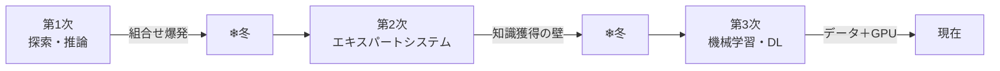

# ① AIの歴史・動向

> 計画 6/24。年号の丸暗記ではなく、**「なぜそうなったか」の物語**として読むと記憶に残る。一本のストーリーとして追ってみてください。

## はじまり：1956年、ダートマスの夏
物語は1956年の夏、アメリカのダートマス大学に始まる。若き研究者たちが集まり、そのリーダー **ジョン・マッカーシー** が、人類で初めて **「人工知能（Artificial Intelligence）」** という言葉を使った（ミンスキーやシャノンも同席）。彼らの夢は壮大で、**「人間の知能は、記号とルールで書き下せるはずだ」**と本気で信じていた。この立場が後に **記号主義（GOFAI）** と呼ばれる。AIの歴史は、この夢が**3度ふくらみ、2度しぼんだ**物語として読める。

## 第1次ブーム：迷路は解けても、現実は解けない
最初にAIが見せた得意技は **探索** だった。問題を「状態の枝分かれ」として表し、迷路やパズル、簡単な定理証明を解いてみせた。世間は「機械が考えている！」と沸いた。

ところが現実の問題に向けた瞬間、AIは行き詰まる。選択肢が一手ごとに爆発的に増え（**組合せ爆発**）、現実的な時間で探索しきれない。結局、ルールが完全に決まった**おもちゃのような問題（トイ・プロブレム）**しか解けないと露呈し、期待は失望に変わって**最初の冬**が訪れた。

同じ頃、別の系譜も芽吹いていた。**1958年、ローゼンブラット**が脳の神経細胞をまねた **パーセプトロン** を作り、学習する機械として注目を集める。だが**1969年、ミンスキーとパパート**が「単層パーセプトロンは直線でしか分けられず、**XOR すら解けない**」と数学的に示してとどめを刺し、ニューラルネットの研究もここで一度凍りつく。

## 第2次ブーム：知識を詰め込めばいい、はずだった
冬を抜ける鍵は「反省」だった——**賢くないのは知識が足りないからだ**。そこで専門家の知識を **if-then のルール**にして大量に詰め込む **エキスパートシステム** が主役になる。化学構造を推定する **DENDRAL**（1965、開発者の **ファイゲンバウム** は“エキスパートシステムの父”）、細菌感染症を診断する **MYCIN**（1972、正答率およそ65%）が代表例だ。日本もこの波に乗り、**1982年に「第五世代コンピュータ」**へ約570億円を投じた。

しかし、またも壁にぶつかる。専門家の頭の中にある知識を**もれなく書き出し、例外や常識、矛盾まで人手で維持する**のは、現実には不可能だった。これを **知識獲得のボトルネック** と呼ぶ。世界中の常識を全部入力しようとした Cyc プロジェクトの苦闘がそれを象徴する。こうして**2度目の冬**が来る。

## 第3次ブーム：人が教えるのをやめ、データに学ばせる
3度目のブームは、発想の逆転から生まれた。**人間がルールを書くのをやめ、大量のデータから機械自身に法則を見つけさせる**——これが **機械学習** だ。ニューラルネット側でも、すでに**1986年にラメルハートら**が **誤差逆伝播法** を広め、多層の学習に道をつけていた。足りなかったのは「データ」と「計算力」だけだった。

その2つが2000年代に揃う。Webが大量のデータ（**ビッグデータ**）を生み、**GPU** が計算を一気に速めた。そして決定的瞬間が **2012年**——ヒントン研究室の **AlexNet** が画像認識コンペ ILSVRC で他を圧倒し、世界が「ディープラーニングは本物だ」と悟った。今回は**ビッグデータ・GPU・誤差逆伝播**の三つが噛み合い、冬は来ていない。以後、**GAN（2014）→ AlphaGo（2016）→ Transformer（2017）→ ChatGPT（2022）** と加速が続く。

> 一言でいうと第2次→第3次の本質は **「ルールからデータへ」**。人が教える時代から、データで学ぶ時代へ。

## 道中で生まれた“問い”
AIが進むほど、技術と並んで**哲学的な問い**も浮かんだ。これらはストーリーの伏線として押さえておくとよい。

そもそも「知能がある」とはどういうことか。**チューリング**は割り切って、**「会話して人間と区別できなければ知能と呼ぼう」**と提案した（**チューリングテスト**）。これに **サール** が噛みつく。**「マニュアル通りに記号を並べ替えているだけの機械が、本当に“理解”していると言えるのか？」**——本人は中国語を一切わからないのに外からは理解しているように見える、という思考実験が **中国語の部屋** だ。これは意識を持つ **強いAI** への批判で、道具にすぎない **弱いAI**（＝現存するすべてのAI）と対比される。

ほかにも、行動するとき「何が関係あって何が無関係か」を切り分けられない **フレーム問題**、記号と実世界の意味が結びつかない **シンボルグラウンディング問題** が、知能の難しさとして繰り返し登場する。

---

## 頻出ひっかけ
- 「AI」と命名したのは **マッカーシー**（チューリング・ミンスキーではない／ダートマス会議1956）。
- **トイ・プロブレム＝第1次**の限界／**知識獲得のボトルネック＝第2次**の限界。取り違え注意。
- **中国語の部屋＝「強いAI」批判**、**チューリングテスト＝知能の操作的定義**。役割を逆にしない。
- 単層パーセプトロンの限界（XOR）を示したのは **ミンスキー&パパート（1969）**。
- 現存するAIはすべて **弱いAI**。

📝 **確認**：3つのブームを「何ができて → なぜ冷め → 何が突破口になったか」の物語として、年号なしで人に説明できる？

## 【出典】
- 総務省「令和6年版 情報通信白書」第1〜3次AIブームと冬の時代　https://www.soumu.go.jp/johotsusintokei/whitepaper/ja/r06/html/nd131110.html
- ダートマス会議（Wikipedia 日本語）　https://ja.wikipedia.org/wiki/ダートマス会議
- パーセプトロン／フランク・ローゼンブラット（Wikipedia 日本語）　https://ja.wikipedia.org/wiki/パーセプトロン
- AlexNet（Wikipedia 英語）　https://en.wikipedia.org/wiki/AlexNet
- エキスパートシステム DENDRAL・MYCIN・第五世代（G検定対策解説）　https://tt-tsukumochi.com/archives/5901

> 暗記の反復は `ai-history` カード。年号・固有名詞はテキストでも最終確認を。
