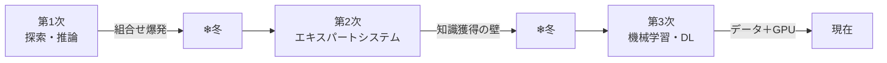

# ① AIの歴史・動向

> 計画 6/24。配点は軽いが、**各時代が「何を実現し、なぜ行き詰まり、次に何が突破口になったか」**という因果で読むと、後続の章（ML/DL）の必然性まで見えてくる。

## 全体像：パラダイムの3段階
AIの歴史は「知能をどう実装しようとしたか」のパラダイム転換の歴史。**探索・推論 →（人間が）知識を記述 →（機械が）データから学習**、と主役が移ってきた。各転換は前の限界への回答になっている。

---

## 第1次ブーム（1950s–60s）：探索と推論
コンピュータに**明示的なルールと探索**で問題を解かせた時代。状態空間をグラフとして表現し、迷路・パズル・定理証明・ゲームを「探索」で解いた。ダートマス会議（1956、マッカーシーが "AI" を命名）が出発点で、「記号を操作すれば知能が作れる」という**記号主義（GOFAI）**の楽観があった。

行き詰まりの本質は**組合せ爆発**。手数が増えると探索空間が指数的に膨らみ、計算が破綻する。しかも解けたのはルールが完全に定義された**トイ・プロブレム**だけで、曖昧さや例外だらけの現実問題には通用しなかった。これが第1次の冬。

## 第2次ブーム（1980s）：知識をルール化する
「現実が解けないのは“知識”が足りないからだ」という反省から、**専門家の知識を if-then ルールにして大量に詰め込む**エキスパートシステムが登場。医療診断（MYCIN）や設備設計で実用化され、第2次ブームを牽引した。

しかし**知識獲得のボトルネック**で再び失速する。専門家の暗黙知を漏れなくルール化するのは膨大な作業で、例外・常識・ルール同士の矛盾を人手で維持しきれない。世界の常識をすべて書き出そうとしたCycプロジェクトの苦闘が象徴的。「知識を人間が書く」アプローチの限界が露呈した。

## 第3次ブーム（2000s–現在）：データから学ぶ
発想を逆転させ、**人間がルールを書くのをやめ、データから機械自身に法則を学ばせる**機械学習が主役に。とくに**ディープラーニング**は、生データから特徴量を階層的に自動獲得できる点で決定的だった（＝特徴量エンジニアリングからの解放）。

冬が来ていない理由は技術的条件が揃ったから——**ビッグデータ**（Web由来の大量教師データ）、**GPU**による並列計算力、**誤差逆伝播＋深層化の学習ノウハウ**の三位一体。2012年のAlexNet（ILSVRCで圧勝）が転換点で、以後CNN→RNN→Transformer→LLMと加速している。

---

## 古典AIが突きつけた「難問」（定義を正確に）
これらは「知能を記号処理で作る」路線が直面した根本問題。名称・提唱者・要点をセットで。

- **フレーム問題**（マッカーシー&ヘイズ提起、デネットの例示）：ある行動に際し「世界の中で何が変化し／何が変化せず、何を考慮すべきか」を有限時間で切り分けられない。人間は無意識に関係範囲（フレーム）を絞るが、AIは可能性を検討し尽くせず停止する。
- **シンボルグラウンディング問題**（ハルナド）：記号「りんご」が実世界のりんごの意味に**接地（grounding）**していない。記号を別の記号で説明し続けても意味に到達しない、という問題。身体性の議論につながる。
- **中国語の部屋**（サール）：マニュアル通りの記号操作は外から見れば理解しているようでも、本人は意味を理解していない。**統語的処理は意味理解・意識を含意しない**として、意識を持つ「強いAI」を批判した。
- **強いAI / 弱いAI**：強い＝意識・理解を本当に持つAI、弱い＝あくまで道具としての知能。現存するのはすべて弱いAI。
- **チューリングテスト**（チューリング, 1950）：知能を内部構造でなく**振る舞いの区別不可能性**で操作的に定義する。

## マイルストーン（因果で）
- **2006 ヒントン**：層ごとの事前学習で深層NNの学習を実用化 → DLの起点。
- **2012 AlexNet**：CNN＋GPU＋ReLU＋ドロップアウトで画像認識の誤り率を激減 → 第3次点火。
- **2016 AlphaGo**：DL（局面評価・着手予測）＋モンテカルロ木探索＋自己対戦の強化学習で囲碁を攻略。
- **2017 Transformer / 2022– LLM**：自己注意で系列処理を刷新し、生成AIの時代へ。

---

📝 **確認**：第1〜3次の「実現したこと・冬の技術的原因・次の突破口」を因果でつなげて説明できる？
> カード: `ai-history`。年号・固有名詞はテキストで最終確認。
