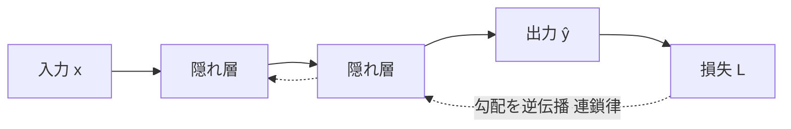
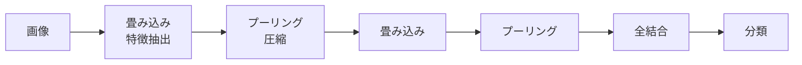
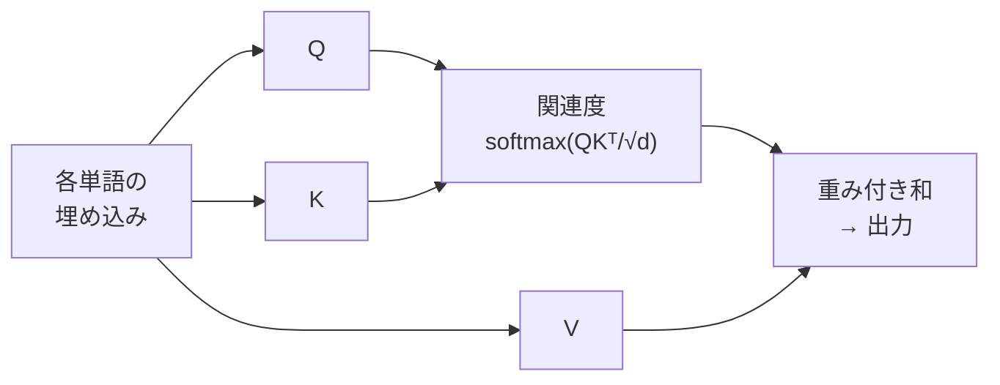

# ③ ディープラーニング

> 計画 6/25（基礎）/ 6/28（手法）。7月のLLM学習の前哨。**「勾配がどう流れるか」**を一本の軸にすると、活性化関数・最適化・各アーキの工夫がすべてつながって見える。

## なぜ「深さ」が効くのか
ニューラルネットワークは、線形変換（重み付き和）と非線形な活性化関数を交互に重ねた関数近似器。1層だけのパーセプトロンは直線でしか分けられず、**XOR**すら解けない（線形分離不可）——これが第1次の停滞要因の一つだった。

層を深く重ねると、各層が前の層の特徴を組み合わせ、**低次→高次の特徴を階層的に自動獲得**できる（画像なら エッジ→模様→部品→物体）。人間が特徴量を設計する必要がなくなる、これがディープラーニングの本質的な強み。代償として、深い網をどう安定して学習させるかが技術課題になり、その答えの多くが「勾配を消さずに流す工夫」である。

## 学習の仕組み：誤差逆伝播
学習とは、各重みを「損失が減る方向」に少しずつ動かすこと。そのために損失を各重みで微分した**勾配**が必要になる。**誤差逆伝播法（バックプロパゲーション）**は、出力側の誤差を入力側へさかのぼらせ、**連鎖律（合成関数の微分）**で各層の勾配を効率的に一括計算する。順伝播で各層の値を保持し、逆向きに勾配を流すのがポイント。

重みの更新は**ミニバッチSGD**が基本。その改良の系譜を押さえると最適化の話が一望できる：
- **Momentum**：過去の勾配の慣性を加え、振動を抑えつつ加速。
- **AdaGrad**：更新が多い方向ほど学習率を下げる（座標ごとに適応）。
- **RMSProp**：その減衰を指数移動平均にして、学習率が下がりすぎて止まるのを防ぐ。
- **Adam**：Momentum＋RMSProp。慣性と座標別適応学習率を両立し、まず試す既定値的存在。
- 学習率ηが最重要ハイパラ。大きすぎると発散、小さすぎると収束が遅い。

## 活性化関数と勾配消失（深層化の最大の壁）
誤差逆伝播では勾配が層を**掛け算で**伝わる。**シグモイドやtanh**は飽和域で微分がほぼ0になるため、深い網だと小さな値の積で勾配が指数的に0へ近づき、入力側の層が学習されなくなる——これが**勾配消失問題**。

- **ReLU**（max(0,x)）：正領域の勾配が常に1なので消失しにくく、計算も軽い。深層化を実用にした立役者。弱点は入力が常に負だと勾配0で死ぬ（dying ReLU）こと→Leaky ReLU / GELU で対処。
- **ソフトマックス**：多クラス出力を「合計1の確率」に変換。**交差エントロピー**損失と組むと勾配が（予測−正解）という綺麗な形になり学習が安定する。
- 補助技術：**バッチ正規化**（各層の値の分布を整えて勾配を安定させ、学習を速める）、**He/Xavier初期化**（初期スケールを適切に）。

## 過学習対策
- **ドロップアウト**：学習中にニューロンを確率的に無効化。特定ニューロンへの共依存を断ち、暗黙的に多数のサブネットのアンサンブルになるため頑健化する。推論時は全ニューロンを使う。
- ほかに**重み減衰（L2）**、**早期終了**、**データ拡張**。

## 代表アーキテクチャ：それぞれの帰納バイアス
### CNN（画像）

**畳み込み**は小さなフィルタを画像全体に滑らせて局所特徴を抽出する。フィルタの重みを全位置で共有するため、パラメータが激減し、**平行移動に強い（並進不変性）**という画像に適した帰納バイアスを持つ。**プーリング**は領域を代表値に集約して解像度を下げ、計算量削減と微小な位置ずれへの頑健性を与える。
- **ResNet**：層をただ深くすると逆に精度が落ちる「劣化問題」が起きた。出力を **y = F(x) + x** と書く**残差接続（スキップ接続）**を入れると、恒等写像を学びやすく、かつ勾配が足し算の経路で入力側へ直接流れるため勾配消失も防げる。これで152層級の超深層が学習可能に。

### RNN → LSTM/GRU（系列）
RNNは前時刻の隠れ状態を次へ渡し、文章や音声など順序のあるデータを処理する。だが時間方向に誤差を伝える（BPTT）と勾配が消失・爆発しやすく、遠い過去を保てない（**長期依存に弱い**）。**LSTM**は記憶セルと入力/忘却/出力ゲートで「何を覚え何を捨てるか」を学習し、勾配の通り道も確保する。**GRU**はそれを簡略化した版。

### Transformer / Attention（言語・生成AIの主役）

RNNの2つの弱点——①単語を1つずつ順に処理するのでGPUで並列化しづらく遅い ②離れた語の関係を保ちにくい——を**自己注意（Self-Attention）**が解決した。各位置が系列内の全位置を一度に参照し、関連度 **softmax(QKᵀ/√d_k)·V** で重みづけして情報を集める。これにより長距離依存を一定の経路長で捉え、逐次依存がないので並列計算できる。代償は系列長 n に対し計算・メモリが **O(n²)** になること。位置情報は**位置エンコーディング**で注入し、マルチヘッドで部分空間ごとの関係を学ぶ。
- 事前学習＋ファインチューニングが定番（**BERT**＝エンコーダ/穴埋め、**GPT**＝デコーダ/次単語予測）。これが**転移学習**の基盤になっている。

### 生成モデル
- **GAN**：生成器と識別器を敵対させ、騙し合いの中で生成物をリアルにする（学習が不安定になりやすい）。
- **拡散モデル**：データに徐々にノイズを加える過程の逆（ノイズ除去）を学習。Stable Diffusion等の画像生成で主流。

---

📝 **確認**：勾配消失の発生機序と緩和策3つ／ResNetの残差接続が効く理由／AttentionがRNNに対し解決した点と、その計算量の代償。
> カード: `dl`。
