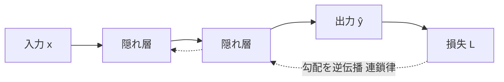
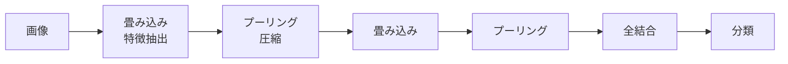
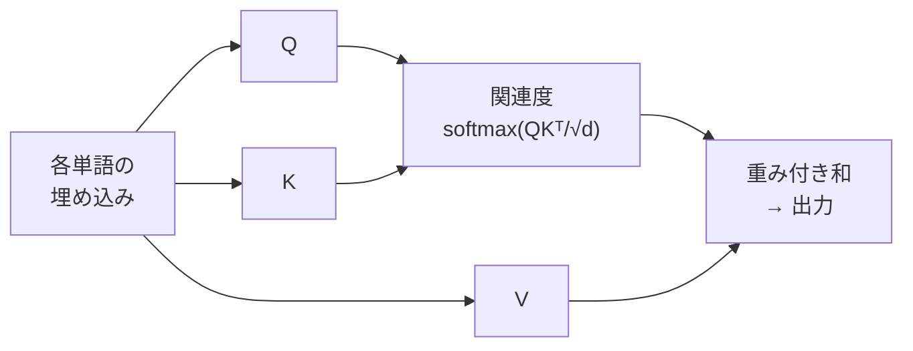

# ③ ディープラーニング

> 計画 6/25（基礎）/ 6/28（手法）。7月のLLM学習の前哨。**「勾配がどう流れるか」**を一本の軸にすると、活性化関数・最適化・各アーキの工夫が全部つながる。
> ※ 末尾【出典】で主要アーキの年・提唱者を照合済み。

## なぜ「深さ」が効くのか
ニューラルネットは、線形変換（重み付き和）と非線形な活性化関数を交互に重ねた関数近似器。1層のパーセプトロンは直線でしか分けられず**XOR**すら解けない（1969 ミンスキー&パパートの指摘）。層を深く重ねると、各層が前層の特徴を組み合わせ、**低次→高次の特徴を階層的に自動獲得**できる（画像なら エッジ→模様→部品→物体）。人間が特徴量を設計する必要がなくなる——これがDLの本質的強み。代償として深い網の安定学習が課題になり、その答えの多くが**「勾配を消さずに流す工夫」**。

## 学習の仕組み：誤差逆伝播
学習＝各重みを「損失が減る方向」に動かすこと。そのため損失を各重みで微分した**勾配**が要る。**誤差逆伝播法**は、出力側の誤差を入力側へさかのぼらせ、**連鎖律（合成関数の微分）**で各層の勾配を効率的に一括計算する。順伝播で各層の値を保持し、逆向きに勾配を流すのがポイント。

更新は**ミニバッチSGD**が基本。改良の系譜：
- **Momentum**：過去の勾配の慣性を加え振動を抑え加速。
- **AdaGrad**：更新の多い方向ほど学習率を下げる（座標ごとに適応）。
- **RMSProp**：その減衰を指数移動平均にし、学習率が下がりすぎて止まるのを防ぐ。
- **Adam**：Momentum＋RMSProp。まず試す既定値的存在。学習率ηが最重要ハイパラ。

## 活性化関数と勾配消失（深層化の最大の壁）
逆伝播では勾配が層を**掛け算で**伝わる。**シグモイド/tanh**は飽和域で微分がほぼ0なので、深い網だと小さな値の積で勾配が指数的に0へ近づき入力側が学習されない——**勾配消失問題**（1991 Hochreiter が定式化）。
- **ReLU**（max(0,x)）：正領域の勾配が常に1で消失しにくく、計算も軽い。深層化を実用にした立役者。難点は入力が常に負だと勾配0で死ぬ（**dying ReLU**）→ Leaky ReLU / GELU。
- **ソフトマックス**：多クラス出力を「合計1の確率」に。**交差エントロピー**損失と組むと勾配が（予測−正解）の形になり安定。
- 補助：**バッチ正規化**（各層の値の分布を整え勾配を安定化、学習を高速化）、**He/Xavier初期化**。

## 過学習対策
- **ドロップアウト**（ヒントンら, 2012頃）：学習中にニューロンを確率的に無効化。共依存を断ち、暗黙的に多数のサブネットのアンサンブルになるため頑健化。推論時は全ニューロンを使う。
- **重み減衰（L2）**、**早期終了**、**データ拡張**。

## 代表アーキテクチャ：帰納バイアスで覚える
### CNN（画像）

**畳み込み**は小さなフィルタを画像全体に滑らせ局所特徴を抽出。**重みを全位置で共有**するためパラメータが激減し、**並進不変性**という画像向きの帰納バイアスを持つ。**プーリング**（max等）は領域を代表値に集約し、計算量削減と微小な位置ずれへの頑健性を与える。
- **ResNet**（2015, He ら）：層をただ深くすると精度が落ちる「劣化問題」が起きる。出力を **y = F(x) + x** と書く**残差接続（スキップ接続）**で恒等写像を学びやすくし、勾配も足し算経路で入力側へ直接流れるため勾配消失も防ぐ。152層級の超深層が学習可能に。

### RNN → LSTM/GRU（系列）
RNNは前時刻の隠れ状態を次へ渡し、系列を順に処理。時間方向に誤差を伝える（**BPTT**）と勾配が消失・爆発しやすく**長期依存に弱い**。**LSTM**（1997, Hochreiter & Schmidhuber）は記憶セルと**入力/忘却/出力ゲート**で「何を覚え何を捨てるか」を学習し、勾配の通り道も確保する。**GRU**はその簡略版。

### Transformer / Attention（言語・生成AIの主役）

**Transformer**（2017, Google）はRNNの2弱点を**自己注意**で解決した。①単語を1つずつ順に処理するので並列化しづらく遅い ②離れた語の関係を保ちにくい——に対し、各位置が全位置を一度に参照し関連度 **softmax(QKᵀ/√d_k)·V** で情報を集める。これで長距離依存を一定の経路長で捉え、逐次依存がなく並列計算もできる。代償は系列長 n に対し計算・メモリが **O(n²)**。位置情報は**位置エンコーディング**で注入、**マルチヘッド**で部分空間ごとの関係を学ぶ。
- 事前学習＋ファインチューニングが定番（**BERT**＝エンコーダ/穴埋め、**GPT**＝デコーダ/次単語予測）。**転移学習**の基盤。

### 生成モデル
- **GAN**（2014, グッドフェロー）：生成器と識別器を敵対させ、騙し合いで生成物をリアルに（学習が不安定になりやすい）。
- **拡散モデル**：データに徐々にノイズを加える過程の逆（ノイズ除去）を学習。Stable Diffusion 等の画像生成で主流。

---

📝 **確認**：勾配消失の発生機序と緩和策3つ／ResNetの残差接続が効く理由／AttentionがRNNに対し解決した点とO(n²)の代償。

## 【出典】
- LSTM（1997, Hochreiter & Schmidhuber）／勾配消失の定式化（1991）— Jürgen Schmidhuber（Wikipedia 英語）　https://en.wikipedia.org/wiki/J%C3%BCrgen_Schmidhuber
- 残差ネットワーク ResNet（残差接続, 2015）（Wikipedia 英語）　https://en.wikipedia.org/wiki/Residual_neural_network
- AlexNet（2012, ILSVRC, ヒントン研）（Wikipedia 英語）　https://en.wikipedia.org/wiki/AlexNet

> 暗記の反復は `dl` カード。
