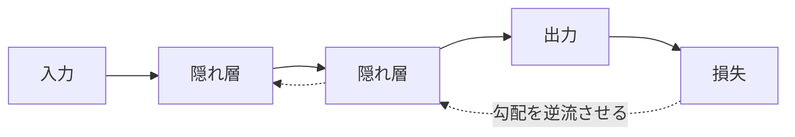
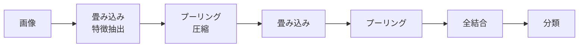

# ③ ディープラーニング

> この分野は登場人物（CNN・RNN・Transformer…）が多くて混乱しやすい。だが実は、**「勾配をいかに消さずに流すか」という一本の戦いの物語**として読むと、ほぼ全部の工夫がつながる。
> ※ 末尾【出典】で主要アーキの年・提唱者を照合済み。

## 序章：一度死んだニューラルネット
1958年に生まれたパーセプトロンは、1969年にミンスキーらから「**直線でしか分けられない（XORすら解けない）**」と致命傷を負わされた。ただし彼らの指摘は正確には「**単層では**」だった。層を重ねれば表現力は上がる——問題は、**多層のネットワークをどうやって学習させるか**、誰も知らなかったことだ。

答えが**誤差逆伝播法**（1986年にラメルハートらが広めた）。学習とは「損失が減る方向に各重みを少し動かす」ことの繰り返しで、そのためには「各重みをいじると損失がどう変わるか」＝**勾配**が要る。誤差逆伝播は、出力側で測った誤差を**連鎖律（合成関数の微分）で入力側へさかのぼらせ**、全層の勾配を一気に計算する仕組みだ。

```mermaid
flowchart LR
  X["入力"] --> H1["隠れ層"] --> H2["隠れ層"] --> Y["出力"] --> L["損失"]
  L -.->|勾配を逆流させる| H2
  H2 -.-> H1
```

なぜ「深く」したいのか。層を重ねると、各層が前の層の出力を組み合わせて、**単純な特徴から複雑な特徴を階層的に自動獲得**できるからだ（画像なら エッジ→模様→部品→物体）。それまで人間が手作業で設計していた特徴量を、機械が自分で見つける——これがディープラーニングの本質的な強みだ。

## 第一の壁：勾配が消える
ところが層を深くすると、逆伝播の途中で勾配が弱まり、入力に近い層まで届かなくなる。**勾配消失問題**だ。原因は掛け算にある。勾配は層をさかのぼるたびに**各層の微分を掛け算**されるが、当時主流の**シグモイド関数は微分が最大でも0.25**。1より小さい数を何度も掛ければ、値は指数的に0へ向かう。深い網の手前の層は、ほとんど学習されないまま放置された。

この壁を崩した工夫たちが、G検定の頻出用語になっている。

- **ReLU**（max(0, x)）：正の領域では**微分がずっと1**なので、掛け算しても勾配が痩せない。計算も軽い。深層化を実用にした最大の立役者。（弱点：負に落ちたニューロンが学習しなくなる「dying ReLU」→ Leaky ReLU などの変種）
- **バッチ正規化**：各層に流れる値の分布を整えて、学習を安定・高速化する。
- **適切な重みの初期化**（Xavier / He の初期値）。

学習の進め方（オプティマイザ）にも系譜がある。基本は**ミニバッチSGD**（確率的勾配降下法）。そこに「過去の勾配の勢いを足す」**Momentum**、「よく動く方向の学習率を自動で下げる」**AdaGrad**（改良版 **RMSProp**）が生まれ、両者を合流させた **Adam** が「まず試す定番」になった。最重要ハイパーパラメータは**学習率**——大きすぎると発散、小さすぎると進まない。

過学習との戦いはDLでも続く。名物は**ドロップアウト**：学習中にニューロンをランダムに無効化する。特定のニューロン頼みの丸暗記ができなくなり、実質的に多数のサブネットワークの合議（アンサンブル）になる。**無効化するのは学習時だけで、推論時は全ニューロンを使う**——ここが定番のひっかけ。

## 登場人物たち：得意分野は「作りの偏り」で決まる
アーキテクチャは「どんなデータ向けの偏り（帰納バイアス）を作り込んだか」で覚えると混ざらない。

### CNN — 画像の専門家

```mermaid
flowchart LR
  I["画像"] --> C1["畳み込み<br/>特徴抽出"] --> P1["プーリング<br/>圧縮"] --> C2["畳み込み"] --> P2["プーリング"] --> FC["全結合"] --> O["分類"]
```
画像のヒントは「隣り合う画素はまとまって意味を持つ」「猫は左上にいても右下にいても猫」。CNNはこれを構造にした。**畳み込み**は小さなフィルタを画像全体に滑らせて局所特徴を拾う——**同じフィルタを全位置で使い回す**のでパラメータが激減し、位置がずれても同じ特徴を検出できる。**プーリング**は領域を代表値（maxなど）に集約して、情報を圧縮しつつ微小な位置ずれに強くする。

2012年、このCNN（**AlexNet**）が画像認識コンペILSVRCを制して第3次ブームに火をつけた。そして2015年の**ResNet**は「深くしすぎるとかえって精度が落ちる」問題を、**スキップ接続（残差接続）**——層の出力に入力をそのまま足す **y = F(x) + x** ——で解決した。足し算の迂回路を勾配がそのまま通れるので、100層を超える超深層でも勾配が消えない。ここでも敵は勾配消失だった。

### RNN → LSTM — 記憶をもつ読み手
文章や時系列は「順番」に意味がある。**RNN**は前の時刻の隠れ状態を次の時刻へ渡し、系列を順に読む。だが時間方向にも逆伝播（BPTT）で勾配の掛け算が起きるため、**長い系列では勾配が消え、昔の情報を覚えていられない**（長期依存の問題）。

**LSTM**（1997, Hochreiter & Schmidhuber）はネットワークに「記憶セル」と**3つのゲート（入力・忘却・出力）**を持たせ、「何を覚え、何を忘れ、何を出すか」を学習で制御できるようにした。ゲートで守られた記憶の通り道が、勾配の通り道にもなる。**GRU**はその簡略版。

### Transformer — 全部を一度に見る
それでもRNNには限界が残った。①1語ずつ順に処理するので**並列化できず遅い**、②離れた単語の関係が弱い。2017年、Googleの**Transformer**は「順に読むのをやめて、**各単語が文中の全単語を一度に見渡し、関連の強い単語から情報を集める**」という**自己注意（Self-Attention）**でこれを一挙に解決した。逐次処理がないのでGPUで並列計算でき、どんなに離れた単語も直接つながる。代償として、計算量は**系列長の2乗**に比例して膨らむ。語順の情報は**位置エンコーディング**で別途注入する。

Transformerの上に「大量テキストで**事前学習**→タスクに**ファインチューニング**」という定番が築かれた。**BERT**はエンコーダ型（穴埋めで文を理解）、**GPT**はデコーダ型（次の単語を予測して文を生成）。ここからLLMの時代が始まる。

### 生成モデル — 見分ける、から、作り出す、へ
- **GAN**（2014, グッドフェロー）：偽物を作る**生成器**と、本物か見破る**識別器**を競わせ、騙し合いの果てにリアルな生成物を得る。学習が不安定になりやすいのが難点。
- **拡散モデル**：画像に少しずつノイズを加えて壊す過程を逆再生する「ノイズ除去」を学習する。Stable Diffusion など現在の画像生成の主流。

> 一言でいうとDLの歴史は、**「深くしたい → 勾配が消える → 流れ道を作る（ReLU・LSTMのゲート・ResNetの迂回路）→ ついでに順次処理もやめる（Attention）」**という一本道。

---

## 頻出ひっかけ
- 勾配消失は**シグモイド/tanhで悪化、ReLUで緩和**。
- **CNN＝画像（位置ずれに強い）／RNN＝系列（順番を扱う）**。取り違えない。
- **ドロップアウトは学習時のみ**。推論時は全ユニットを使う。
- **Transformerは並列計算可・長距離依存に強い**が、計算量は系列長の2乗で増える。
- **ResNet＝スキップ接続（残差接続）**で超深層を可能にした。
- **BERT＝エンコーダ（理解）／GPT＝デコーダ（生成）**。
- 単層パーセプトロンの限界はXOR。**多層＋誤差逆伝播**で克服。

📝 **確認**：勾配消失が「掛け算」から生じる理由と、ReLU・LSTM・ResNetがそれぞれどうやって勾配の通り道を作ったか、人に説明できる？

## 【出典】
- LSTM（1997, Hochreiter & Schmidhuber）／勾配消失の定式化（1991）— Jürgen Schmidhuber（Wikipedia 英語）　https://en.wikipedia.org/wiki/J%C3%BCrgen_Schmidhuber
- 残差ネットワーク ResNet（残差接続, 2015）（Wikipedia 英語）　https://en.wikipedia.org/wiki/Residual_neural_network
- AlexNet（2012, ILSVRC, ヒントン研）（Wikipedia 英語）　https://en.wikipedia.org/wiki/AlexNet

> 暗記の反復は `dl` カード、本番形式の演習は `gtest-ml-dl` デッキで。
