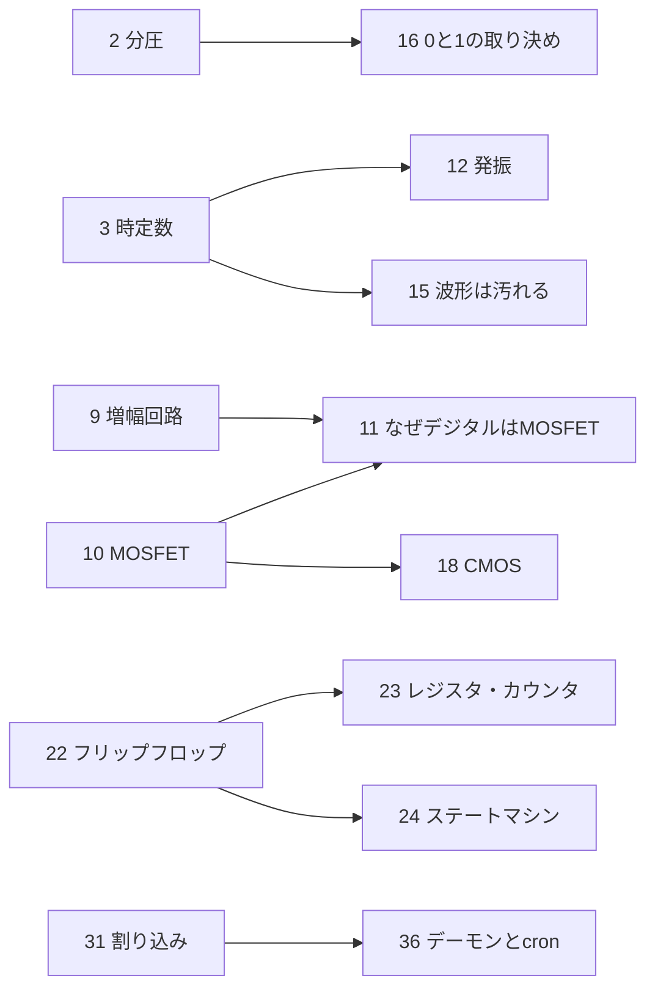

# 🔧 電子回路からOSまで（全36回）

トランジスタからOSまでを、**1回につき「動き」を1つだけ**決めて理解していくシリーズの設計図。
ロードマップ P4（情報工学の体系学習）の教材にあたる。1本60〜80秒・字幕のみ。

文字を並べるのではなく、そこが動くことで分かるように作る。付随する説明は字幕と、一行の結論で足りる。

- 内訳は 第1部4 ＋ 第2部7 ＋ 第3部4 ＋ 第4部9 ＋ 第5部6 ＋ 第6部6 = **36回**
- **36本すべて実装済み**（本文中の `済` は、もともとの参照実装4本の印）
- 残作業は第10回だけ。音声付きの実装なので、字幕のみ版に直す

## 回をまたぐ伏線

前半で仕込んで後半で回収する対応。ここが繋がると一本の話になる。



---


## 第1部 電気そのもの

**1. 電気とは何か** ── 済(`ep01_denki.py`)
導線の断面に自由電子。静止 → 電池で一方向にドリフト → 断面通過数=電流 →
電圧を上げると速くなる → 原子に衝突して発熱。最後の山:電子1個は秒速0.1mm
しか進まないのに、押し合いは光速で伝わる。

**2. 回路の読み方** ── 済(`ep02_kairo.py`)
6V/3Ω → 2A。抵抗を倍にすると半分。直列は電流共通・電圧分割、並列は
電圧共通・電流分割。流れる点の数と速さを電流値に比例させている。

**3. コンデンサとコイル**
2枚の板に電荷が溜まっていくのを点の数で見せ、同時に充電カーブを右に描き足す。
カーブが63%に達した時刻に目盛りを立てて「時定数」と呼ぶ。コイルは逆に、
流れを保とうとして立ち上がりが遅れる様子。**時定数が主役**。第12回と第15回で
二度使うので、ここで曲線の形を目に焼き付けさせる。

**4. 交流と波形**
左に回る矢印、右に波形。矢印の縦成分を右へ描き出していくと正弦波になる、
という対応をそのまま動かす。回転が速い=周波数、スタート角度の差=位相。
「波は回転の影」が伝われば成功。

## 第2部 半導体

**5. なぜシリコンなのか**
原子1個から。手が4本 → 格子で全部つながる → 動ける電子が0個。
導体(手が余る)・絶縁体(固く結ばれて動かない)・半導体(ぎりぎり)の
3枚を横に並べ、同じ電圧をかけて流れる量を比較する。

**6. 不純物を混ぜる**
完成した格子に、リン(手5本)を1個差し込むと電子が1個余る。ホウ素(手3本)
なら穴が空く。**穴に隣の電子が落ちて、穴が左へ歩いていく**のを繰り返し見せる。
穴がプラスの粒として扱える理由がここで腑に落ちる。

**7. pn接合とダイオード**
n側とp側を近づけて接触。境界で電子が穴に落ちて埋まり、空乏層(誰もいない帯)
ができる。順方向電圧で帯が薄くなって流れ、逆方向で厚くなって止まる。最後に
正弦波を入力して、片側だけが残る(整流)ところまで。

**8. バイポーラトランジスタ**
ベースに細い流れを少し通すと、コレクタ→エミッタに太い流れが出る。細い流れを
2倍にすると太い流れも2倍。**小さな入力が大きな出力を支配する**という一点。
第1部の「スイッチ」とは違い、比例している点を強調する。

**9. 増幅回路**
小さな波を入れて大きな波が出てくる。次に動作点を端に寄せると、波の頭が
天井に当たって潰れる(歪み)。だから真ん中に置く。アナログが「連続」で
あることの意味と、その脆さ。

**10. MOSFET** ── 済(`ep10_mosfet_narrated.py`)
n-p-n の三領域、ゲートに電圧、空き地の電子が表面に集まって橋になる。
※ 参照実装は音声付き。字幕のみ版に直して使う。

**11. なぜデジタルはMOSFETなのか**
同じ入力波を2本並べる。上は増幅器として使った出力(なだらか)、下はスイッチ
として使った出力(しきい値で角が立つ)。さらに待機時の消費電流を数値で対比。
増幅素子がスイッチに転職した経緯。

## 第3部 時間をつくる

**12. 発振**
増幅器の出力を入力に戻す線を1本つなぐ。遅れと利得が合うと、小さな揺れが
勝手に育って持続する。**ブランコを押すタイミング**の絵を重ねる。合わないと
減衰する/暴れる、という失敗例も見せる。

**13. 水晶振動子**
水晶片に電圧をかけると変形し、変形させると電圧が出る(圧電)。両方向の矢印で。
次に色々な周波数で揺すってみて、固有振動数だけが大きく振れる様子。
32,768 = 2の15乗。15段のフリップフロップで割ると1秒になる、を数字で示す。

**14. クロックとパルス**
矩形波を1本流し、立ち上がりの瞬間に離れた部品が**一斉に**動く絵。
デューティ比。最後に、クロックを速くしすぎると遠い部品に届く前に次の波が
来てしまう(だから周波数に上限がある)。

**15. 波形は汚れる**
きれいな矩形を入れたのに、受け側ではなまって丸くなっている。しきい値の
近くでふらつくと0か1か決まらない。シュミットトリガで**しきい値を上下2つ**
持たせて、角を立て直す。第3回の時定数がここで効く。

## 第4部 論理

**16. 0と1という取り決め**
電圧の帯を3つに分ける。0の領域/どちらでもない禁止帯/1の領域。ノイズを
のせても帯の中に収まれば情報は無傷。第2回の分圧がここで効く。
デジタルが汚れに強い本当の理由。

**17. 直列と並列** ── 済(`ep17_and_or.py`)
一本道に橋2つ=かつ、道2本に橋=または。最後に真理値表。

**18. CMOSとNOT・NAND・NOR**
pMOSを上・nMOSを下に積み、入力を振ると出力が必ず反転する。次に下段を
直列に組み替えるとNAND、並列だとNOR。**なぜ素直なANDが作れないのか**
(pMOSは1を伝える担当、nMOSは0を伝える担当で役が固定)を回収する。

**19. ブール代数とド・モルガン**
NANDを1個だけ置く。配線を変えるだけでNOT→AND→ORが順に出来上がる。
同じ部品が役を変えていくのを一続きのアニメーションで。

**20. 2進数と負の数**
桁の重み(1,2,4,8)を皿に乗せる天秤。次に補数を**一周する時計**で見せ、
-1 が 1111 になる理由と、引き算が足し算で済む理由。

**21. 加算器**
1桁の足し算の真理値表を書く → 和がXOR、繰り上がりがANDと一致することに
気付かせる → 半加算器 → 全加算器 → 4桁に連結。**繰り上がりが左へ伝播していく
のをコマ送りで**。論理が計算になる回で、第4部の山場。

**22. フリップフロップ**
NANDを2個、互いの出力を相手の入力に戻す。片方を一瞬叩くと状態が固定され、
手を離しても保持される。**それまでの回路に無かった「過去」がここで生まれる。**

**23. レジスタ・カウンタ・シフト**
フリップフロップを8個並べて8ビット保持。クロックごとに+1するカウンタ、
1個ずつ横にずれるシフトレジスタ。同じ部品の並べ方だけで機能が変わる。

**24. ステートマシン**
信号機で。状態を丸、遷移を矢印。それを「現在状態を持つレジスタ」+
「次状態を決める論理回路」の2ブロックに還元する。制御回路の原型。

## 第5部 コンピュータになる

**25. ALUとバス**
加算器と論理回路を束ね、セレクタで「どの結果を出すか」を選ぶ。バスは
1本の共用道路で、時刻をずらして使い分けている様子。

**26. 命令という発明**
メモリの同じ数値を、データとして読む場合と命令として読む場合を並べる。
プログラムカウンタが指す先が次の行為になる。**プログラム内蔵方式**。

**27. フェッチ・デコード・実行**
1命令の一巡をクロックに同期させてコマ送り。PC → メモリ → 命令レジスタ →
デコード → ALU → 書き戻し → PC+1。ここで初めて「動いている」ように見える。

**28. メモリ階層**
レジスタ/L1/L2/DRAM/SSDを距離と面積で並べ、アクセス時間を**歩く距離**に
換算する(1クロックを1歩とすると、DRAMは何百歩)。ヒットとミス。

**29. 現代のCPUの中身**
パイプラインをベルトコンベアで。5工程が同時に別の命令を処理している。
分岐予測が外れた瞬間に、仕掛品を全部捨てる様子。

**30. 機械語から高級言語へ**
1行のコードが、アセンブラ → 機械語のビット列 → ゲートの開閉に落ちていく
縦の連鎖。上から下へ一本で貫く。

## 第6部 OS

**31. 割り込み**
CPUが仕事中に、外から札が上がる。今の状態を棚に預け、ハンドラへ飛び、
終わって棚から戻す。**OSが成立する前提条件**であることを明示する。

**32. 特権モードとシステムコール**
ユーザ空間とカーネルを2部屋に分け、間に1枚だけ扉を置く。勝手に壁を
越えようとすると弾かれる。扉を通るときだけ特権が切り替わる。

**33. プロセスとスケジューラ**
CPUが1個しかないのに3つのプログラムが同時に動いて見える。高速で
持ち替えているだけ。持ち替えのたびにレジスタを棚に出し入れするコスト。

**34. 仮想メモリとMMU**
各プロセスが「0番地から自分のもの」と思っている地図と、実際の物理メモリの
地図を並べ、MMUが間で住所を書き換える。**OSの嘘の作り方**。

**35. ファイルシステム**
ただのブロックの並びの上に、木構造をでっち上げる。ディレクトリは
「名前とブロック番号の対応表」でしかない。断片化。

**36. デーモンとcron**
ユーザ空間に戻る。shell、常駐プロセス、そしてcronは「寝て、起きて、表を見て、
時刻が合えば起動する」だけのループ。使っているシステムコールは他のアプリと
同じ。**出発点だったcronが、ここまでの35回すべての上に立っていると分かる回。**

---

## 制作メモ

1話ずつ作る。まとめて作らない。

```bash
cp ep_template.py ep03_condenser.py   # episode-specs の該当回を読んで実装
python3 ep03_condenser.py
python3 check.py out/ep03_condenser.mp4 3 11 20 28 36
```

**毎回フレームを目で見る。** `ffmpeg` が正常終了しても、ラベルが重なる・画面外に出る・要素が別の要素の上に乗る、は普通に起きる。完成済みの4本すべてで1回目のレンダは何かが重なっていた。exit 0 は「壊れていない」ことしか意味しない。

**高さの帯を守る**（座標系は 160 × 90）。崩れの最大の原因はここ。

| y | 用途 |
|---|---|
| 4〜10 | 字幕。`Scenes.caption()` が置く。触らない |
| 18〜28 | 数式・数値・結論の一行 |
| 35〜70 | 装置本体 |
| 70〜85 | 装置の補助ラベル、矢印 |

- `draw(frame)` は状態を持たない。累積が必要なもの（電子のドリフト位置など）は事前に全フレーム分の配列を計算しておく（`ep01_denki.py` の `DRIFT`）。
- 色は `common.py` の定数だけ。1話ごとに新色を足すと全体でバラける。
- `if __name__ == "__main__":` を必ず付ける。無いと import しただけで本番レンダが走る。
- 20fps / 1280×720 / 字幕21pt以上（スマホで見るため）。`blit=True` は使わない。
- 音声合成（`narrate_optional.py`）は棒読みで実用に届かないため**不採用**。字幕のみで進める。
