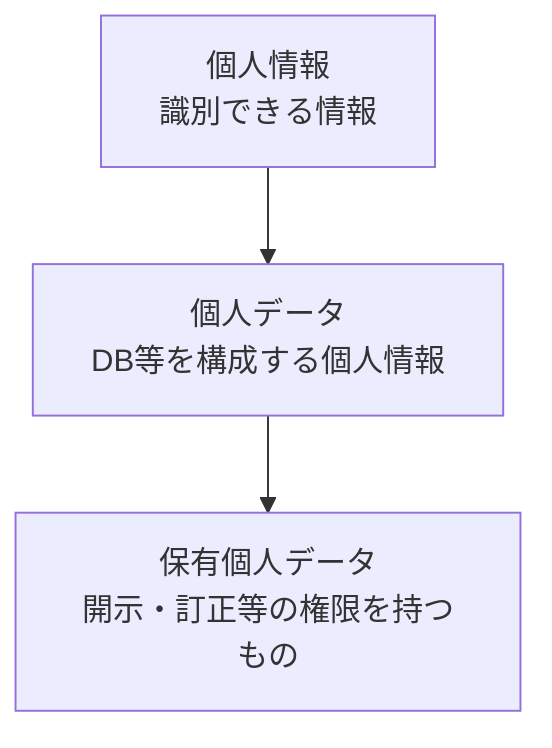
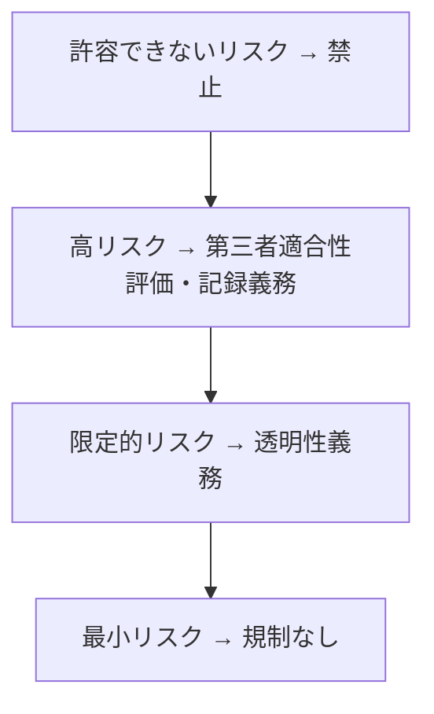

# ④ 法律・倫理・社会実装

> 計画 6/28（前半）/ 6/29（後半）。**本番はシート参照OK**なので、暗記より「定義と引っかけ」を正確に。
> ※ 末尾【出典】で個人情報保護委員会・経産省・文化庁等の一次情報に照合済み。⚠️ 法改正で変わるので最新版は要確認。

## なぜルールが要るのか
AIは大量の個人データを使い、自動で重要判断（採用・与信・診断）を下す。だから **①データの不適切利用 ②差別の再生産 ③ブラックボックス化による無責任** という害が生じうる。法律・ガイドライン・倫理原則はこの3つの害への社会的防御策、と捉えると整理しやすい。

## 個人情報保護法：3つの概念の包含関係
最頻出。**個人情報 ⊃ 個人データ ⊃ 保有個人データ** で、階層が深いほど事業者の義務が増える。

- **個人情報**：生存する個人に関する情報で、氏名・生年月日等で**特定の個人を識別できる**もの（他情報と容易に照合して識別できるものを含む）、または**個人識別符号**を含むもの。
- **個人データ**：「個人情報データベース等」を構成する個人情報（検索できるよう体系的に整理されたもの）。
- **保有個人データ**：事業者が**開示・訂正・利用停止・消去・第三者提供の停止**を行う権限を持つ個人データ。※委託されて預かっているだけのデータは含まない。

### 要配慮個人情報（法2条3項）
**人種・信条・社会的身分・病歴・犯罪の経歴・犯罪被害の事実**＋政令で定めるもの（身体/知的/精神の障害、健康診断の結果、医師の指導・診療、逮捕など刑事手続を受けた事実）。**取得に原則本人同意が必要**で、**オプトアウトによる第三者提供は不可**。

> ⚠️ **引っかけ注意**：**国籍・肌の色・出生地・戸籍**は「人種」とは別扱いで、それ自体は要配慮個人情報に**含まれない**。

### 匿名加工情報 vs 仮名加工情報（差を正確に）
| | 匿名加工情報 | 仮名加工情報 |
|---|---|---|
| 加工レベル | 個人を識別できず、**復元も不可（非可逆）** | 他情報と照合しなければ識別不可（**可逆的**） |
| 第三者提供 | **本人同意なく可**（項目・方法の公表＋匿名加工情報である旨の明示が要件） | **原則不可**（本人同意があっても不可。委託・事業承継・共同利用は例外） |
| 想定用途 | 外部提供を含むデータ利活用 | 主に社内での分析・利用 |

### GDPR（EUの個人データ保護規則）
本人の権利が強い。**忘れられる権利（消去権）**、**データポータビリティ権**が有名。処理には適法根拠（同意・契約・正当な利益等）が必要。**域外適用**（EU圏外の事業者にも適用）と高額の制裁金（全世界年間売上の一定割合）が特徴。

## 著作権とAI（30条の4）
**著作権法30条の4**は、著作物を**「表現を享受しない利用」＝情報解析（AIの学習など）**に使う場合、原則として権利者の許諾なく利用できると定める。日本がAI開発に比較的寛容とされる根拠。
**ただし**「著作権者の利益を**不当に害する**場合」は適用外（例：市場と競合する利用）。また、AI生成物が既存著作物に**依拠・類似**する場合の侵害は別問題。文化庁が考え方を示している。

## ガイドライン・規制（発行主体と性格をセットで）
法的拘束力ある**ハードロー**と、理念・指針を示す**ソフトロー**を区別すると整理が楽。
- **AI事業者ガイドライン**（**経済産業省・総務省**、第1.0版＝2024年）：事業者向けの包括指針（ソフトロー、随時更新の"リビングドキュメント"）。**統合元は3つ**——AI開発ガイドライン（2017・総務省）、AI利活用ガイドライン（2019・総務省）、AI原則実践のためのガバナンスガイドライン（2022・経産省）。
- **人間中心のAI社会原則**（内閣府, 2019）：AIは人間の尊厳を守り能力を拡張する道具であるべき、という理念。上記ガイドラインの上位。
- **OECD AI原則 / G7広島AIプロセス**：国際的な原則づくり。
- **EU AI Act**：世界初の包括的AI規制（ハードロー）。**リスクベース**で4段階。

- **許容できないリスク（禁止）**：社会的スコアリング、サブリミナルな操作、無差別な顔画像スクレイピング等。
- **高リスク**：採用・教育・重要インフラ・医療など。市場投入前に第三者適合性評価が必要。
- **限定的リスク**：チャットボット等。「AIが応対している」ことの明示（透明性）義務。
- **最小リスク**：大多数のAI。追加規制なし。

## 倫理・社会的課題（背景つき）
- **バイアス／公平性**：学習データの偏りがAIの差別的出力を生む（採用・与信・再犯予測で実害）。
- **説明可能性（XAI）**：DLは高精度だが根拠不透明（ブラックボックス）。**LIME**＝予測の周辺を単純モデルで局所近似して効いた特徴を示す。**SHAP**＝協力ゲーム理論のシャプレー値で各特徴の貢献度を公平配分。
- **FAT**：Fairness（公平）・Accountability（説明責任）・Transparency（透明性）＝上記3つの害への対応原則。
- **ハルシネーション**：LLMが事実に反する内容をもっともらしく生成。次語を確率的に選ぶだけで真偽を検証しないため起きる（対策：RAG等）。
- ほか：**ディープフェイク**、**敵対的サンプル**（微小な摂動で誤分類させる攻撃）、**ELSI**（倫理的・法的・社会的課題）、自動運転の**責任帰属**。

## 開発・運用（社会実装）
**PoC（概念実証）→本番**で小さく試す。**MLOps**で運用を継続（**データドリフト/コンセプトドリフト**で精度劣化→監視・再学習）。**CRISP-DM**（ビジネス理解→データ理解→準備→モデリング→評価→展開）。

---

📝 **確認**：匿名加工と仮名加工の「第三者提供」の差／要配慮個人情報に国籍は含まれる？／EU AI Actのリスク4段階と各代表例。

## 【出典】
- 個人情報保護委員会「個人情報・個人データ・保有個人データの違い」FAQ　https://www.ppc.go.jp/all_faq_index/faq4-q007/
- 個人情報保護委員会「匿名加工情報と仮名加工情報の違い」FAQ　https://www.ppc.go.jp/all_faq_index/faq1-q14-1/
- 個人情報保護委員会「要配慮個人情報に関する政令の方向性」　https://www.ppc.go.jp/files/pdf/280603_siryou1.pdf
- 経済産業省「AI事業者ガイドライン（第1.0版）」　https://www.meti.go.jp/press/2024/04/20240419004/20240419004.html
- 著作権法30条の4と生成AI学習（STORIA法律事務所 解説）　https://storialaw.jp/blog/12050
- EU AI Act の規制概要（牛島総合法律事務所）　https://www.ushijima-law.gr.jp/topics/20240902eu-ai-act2/

> 本番はシート参照OK。カード `law` は語→定義の高速引き出し用。
