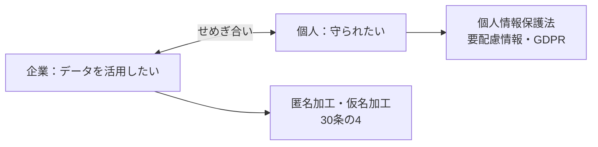

# ④ 法律・倫理・社会実装

> この分野は暗記科目に見えるが、実は**「データを活用したい企業」と「守られたい個人」のせめぎ合い**という一つの物語で、ほぼ全部の制度がつながる。本番はシート参照OKなので、細部より「どの制度がどちら側の要請から生まれたか」を掴む。

## 物語の構図：活用と保護の綱引き
AIはデータを食べて育つ。データが多いほど賢くなる——だからこそ企業はデータを集めたい。だがそのデータの多くは、**個人の生活の断片**だ。放っておけばプライバシーは切り売りされる。そこで法律が「ここまでは使ってよい、ここからはダメ」という線を引く。この綱引きの産物が、以下の制度群だ。

```mermaid
flowchart LR
  A["企業：データを活用したい"] <-->|せめぎ合い| B["個人：守られたい"]
  A --> C["匿名加工・仮名加工<br/>30条の4"]
  B --> D["個人情報保護法<br/>要配慮情報・GDPR"]
```

## 個人情報保護法：守る対象の3段階
まず「何を守るのか」。法律は個人情報を**責任の重さで3段階**に分けている。

```mermaid
flowchart LR
  A["個人情報<br/>個人を識別できる"] --> B["個人データ<br/>DB等で検索できる形"]
  B --> C["保有個人データ<br/>開示・訂正の権限あり"]
```

- **個人情報**：生存する個人を識別できる情報。氏名・生年月日・個人識別符号など。
- **個人データ**：それを検索できるよう体系的に整理したもの。名刺の山は個人情報の集まりだが、名刺管理DBに入れれば個人データになる。
- **保有個人データ**：事業者が開示・訂正・利用停止に応じる義務を負うもの。

整理が進むほど便利になり、同時に漏えい時の被害も大きくなる。だから**段階が上がるほど義務が重くなる**——この構造を掴めば個別の規定は導ける。

さらに、漏れたら差別に直結する情報は特別扱いされる。**要配慮個人情報**——人種、信条、社会的身分、病歴、犯罪歴など。**取得には原則本人の同意が必要**で、**オプトアウト方式での第三者提供は不可**。
頻出ひっかけ：**国籍・肌の色・出生地は、それ自体では要配慮個人情報に当たらない**。

## 加工すれば使ってよい：匿名加工と仮名加工
綱引きの中で企業側が勝ち取ったのが「**個人がわからない形に加工すれば、活用してよい**」という仕組み。加工の徹底度で2種類ある。

| 比較 | 匿名加工情報 | 仮名加工情報 |
|---|---|---|
| 識別性 | 復元不可能なまで加工 | 他の情報と照合すれば識別できる余地 |
| 第三者提供 | 本人同意なしで可能 | **原則不可** |
| 主な用途 | 外部へのデータ提供 | 社内での分析 |
| 覚え方 | **匿名＝外へ出せる** | **仮名＝内部用** |

## 著作権とAI学習：30条の4
学習データには他人の文章や画像も含まれる。ここで日本の**著作権法30条の4**が効く：情報解析など「**表現を享受しない目的**」なら、著作物を**原則許諾なく**利用できる。AI学習に寛容な規定として世界的にも知られる。ただし2つの限界がある——①著作権者の利益を**不当に害する場合は除外**、②これは「学習」の話であって、**生成物が既存作品に似ていれば侵害の判断は別**。

## ルールの2つの流儀：ソフトローとハードロー
AIそのものの規制には、国によって流儀の違いがある。

| 名称 | 主体 | 性格 | 覚える点 |
|---|---|---|---|
| 人間中心のAI社会原則 | **内閣府** | 原則 | 上位理念 |
| AI事業者ガイドライン | **経産省・総務省** | ソフトロー | 開発者・提供者・利用者向け |
| EU AI Act | EU | **ハードロー** | リスクベース規制 |
| GDPR | EU | ハードロー | 忘れられる権利・データポータビリティ・域外適用 |

日本は罰則のない指針で誘導する**ソフトロー**路線、EUは法的拘束力のある**ハードロー**路線。EUの**AI Act**は「用途の危険度に応じて規制の重さを変える」**リスクベース**が特徴で、4段階に分ける：

1. **許容できないリスク**：禁止。社会的スコアリング、サブリミナル操作など。
2. **高リスク**：採用・教育・医療・重要インフラなど。適合性評価や記録義務。
3. **限定的リスク**：チャットボットなど。「AIです」と明かす透明性義務。
4. **最小リスク**：大多数のAI。追加規制なし。

## 信頼されるAIへ：倫理と運用
法律が「最低限の線」なら、倫理は「信頼を得るための上乗せ」だ。キーワードは物語で繋がる：AIの判断が人生を左右する場面（採用・融資・量刑）が増えた → 判断根拠を説明できないと困る → **XAI（説明可能AI）**（LIMEやSHAPが代表技術）→ 公平性・説明責任・透明性をまとめた**FAT**が合言葉に。

運用側の物語も一本道だ：モデルは作って終わりではない → 世の中が変わればデータの傾向も変わり精度が落ちる（**ドリフト**）→ 監視と再学習を回し続ける仕組みが**MLOps**。プロジェクト全体の進め方の型が**CRISP-DM**（ビジネス理解→データ理解→データ準備→モデリング→評価→展開）。

リスク側の用語：学習データの偏りが差別的な出力を生む**バイアス**、LLMがもっともらしい嘘をつく**ハルシネーション**、人間には気づけない微小な改変でAIを騙す**敵対的サンプル**。

---

## 本番の選択肢で見るポイント
- 「所管」→ **AI事業者ガイドライン＝経産省・総務省**、**人間中心のAI社会原則＝内閣府**。
- 「第三者提供」→ **匿名加工は可、仮名加工は原則不可**。
- 「同意」→ **要配慮個人情報の取得は原則本人同意**。
- 「AI学習と著作権」→ **30条の4＝非享受目的なら原則OK（生成物の類似は別問題）**。
- 「EU AI Act」→ **リスク4分類**を探す。

📝 **確認**：匿名加工と仮名加工の第三者提供の差を、「外へ出せる／内部用」の一言で説明できる？

## 【出典】
- 個人情報保護法の定義（個人情報・個人データ・保有個人データ・要配慮個人情報・匿名加工/仮名加工）：個人情報保護委員会　https://www.ppc.go.jp/
- 著作権法30条の4（非享受目的の利用）：e-Gov法令検索「著作権法」　https://elaws.e-gov.go.jp/
- EU AI Act（リスクベースの4分類）：European Commission — AI Act　https://digital-strategy.ec.europa.eu/en/policies/regulatory-framework-ai

> 暗記の反復は `law` カード、本番形式の演習は `gtest-law` デッキで。
