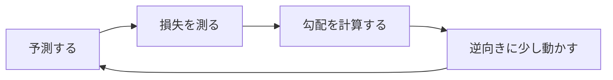

# ⑤ 数理・統計

> 方針：**深追いしない**。G検定は計算問題より「この用語はどの文脈のものか」を見分ける問題が中心。この分野は**「表す（線形代数）・測る（確率統計）・学ぶ（微分）」の3幕の物語**として、AIのどこで使われているかだけ掴めばよい。

## 第1幕：表す — 世界を数の並びにする（線形代数）
機械学習の最初の仕事は、画像も文章も顧客データも、**数の並び（ベクトル）**に変換することだ。データがベクトルになれば、「似ている＝距離が近い」「変換する＝行列を掛ける」と、すべてが計算になる。ニューラルネットの中身も、突き詰めれば**行列の積と非線形変換の繰り返し**だ。

ベクトルの次元が多すぎるときに登場するのが**PCA（主成分分析）**——「一番ばらついている方向が一番情報を持つ」と考えて、その軸に射影して圧縮する。②で出てきた**教師なしの次元削減**の数学的な正体は、共分散行列の固有値分解だ（名前だけ知っていればよい）。

## 第2幕：測る — 不確かさと付き合う（確率・統計）
現実のデータはノイズだらけで、AIの答えはつねに「たぶん」だ。その「たぶん」を扱う道具が確率。

物語の主役は**ベイズの定理**——「**証拠を見て、信念を更新する**」という一行に尽きる。スパムフィルタなら、「無料」という単語を見た（証拠）ことで、スパムである確率（信念）を引き上げる。事前確率が証拠によって事後確率に更新される。ナイーブベイズや確率的推論の土台だ。

統計の基本用語は「データの要約のしかた」として一気に押さえる：

| 言葉 | 何を見るか | ひとこと |
|---|---|---|
| 平均・中央値 | 中心 | **外れ値に引っ張られるのは平均**（年収の平均と中央値のズレが典型） |
| 分散・標準偏差 | ばらつき | 標準化・正規分布の前提 |
| 正規分布 | 釣り鐘型の分布 | 誤差やノイズのモデルの定番 |
| 大数の法則 | 試行を増やすと**平均が期待値に近づく** | 「たくさん試せば安定」 |
| 中心極限定理 | **標本平均の分布**が正規分布に近づく | 正規分布が至る所に現れる理由 |

そして統計最大の落とし穴が**「相関は因果を意味しない」**。アイスの売上と水難事故は一緒に増えるが、原因は互いではなく夏（**交絡要因**）だ。集計の仕方で結論が逆転する**シンプソンのパラドックス**も同じ穴の仲間。

## 第3幕：学ぶ — 坂を下る（微分・最適化）
「学習」の数学的な正体は驚くほど単純だ。**予測のまずさを損失関数で数値化し、損失が減る方向にパラメータを少しずつ動かす**。それだけの繰り返し。

霧の中で山を下りる登山者を思い浮かべるといい。遠くは見えないが、足元の傾き（**勾配**）は分かる。一番急な下り方向へ一歩ずつ——これが**勾配降下法**。歩幅が**学習率**で、大きすぎると谷を飛び越えて発散し、小さすぎるといつまでも着かない。

深いネットワークでは各層の勾配が要るが、それを効率よく計算する数学的根拠が**連鎖律**（合成関数の微分）。③で出てきた**誤差逆伝播法は、連鎖律の実装**にほかならない。

損失関数は2つだけ覚える：

| タスク | 損失 | 覚え方 |
|---|---|---|
| 回帰 | **MSE（平均二乗誤差）** | ズレを二乗して罰する（外れ値に敏感） |
| 分類 | **交差エントロピー** | 正解クラスの確率が低いほど強く罰する |

**エントロピー**は「不確実性・驚きの量」の尺度で、決定木の情報利得もこれが根拠。2つの確率分布のズレを測るのが**KLダイバージェンス**——**AからBとBからAで値が違う（非対称）**という点だけがひっかけで問われる。

## 捨ててよいもの
手計算の証明、細かい統計検定、複雑な確率計算は捨てる。本番で問われるのは「導出できるか」ではなく**「どの用語がどの文脈か」**。上の3幕（表す・測る・学ぶ）のどこの話かが言えれば十分。

---

## 頻出ひっかけ
- **相関は因果を意味しない**（交絡要因・シンプソンのパラドックス）。
- **MSEは回帰、交差エントロピーは分類**。
- **PCAは教師なしの次元削減**。分類器ではない。
- **KLダイバージェンスは非対称**。
- **連鎖律が誤差逆伝播の根拠**。
- **大数の法則**（平均が期待値へ）と**中心極限定理**（標本平均の分布が正規分布へ）を混同しない。

📝 **確認**：勾配降下法を「霧の山下り」の比喩で、学習率の大きすぎ/小さすぎの失敗まで含めて人に説明できる？

> 暗記の反復は `ml`・`dl` カードに含む。シートに残すのは「ひっかけ」6行だけでよい。
