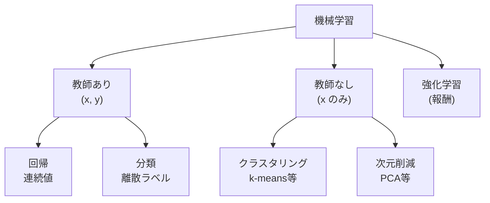

# ② 機械学習の手法

> 計画 6/27。最大配点。**「何を手がかりに学ぶか（パラダイム）」「どんな仮定で線を引くか（帰納バイアス）」「どう評価するか」**の3点で整理すると暗記が激減する。
> ※ 末尾【出典】で評価指標・アンサンブル等を照合済み。

## 機械学習とは何をしているのか
データから入力→出力の規則性を**自動で**獲得する枠組み。古典AIが人手のルールに依存したのに対し、モデルがパラメータを調整して規則を「学ぶ」。学び方で3パラダイムに分かれる。

- **教師あり**：(x, y) の正解つきデータから写像 f: x→y を学ぶ。yが連続なら**回帰**、離散なら**分類**。
- **教師なし**：x のみ。データに内在する構造（かたまり＝クラスタ、低次元の軸＝主成分）を見つける。
- **強化学習**：正解の代わりに**報酬**。エージェントが環境で行動し、累積報酬 E[Σγ^t r_t] を最大化する方策を試行錯誤で学ぶ。**探索（新しい手を試す）と活用（既知の良い手を使う）のトレードオフ**が核心。

近年のLLMの土台**自己教師あり学習**は、ラベルなしデータから「次の単語を予測」などの擬似タスクを作って教師あり的に学ぶ、両者の橋渡し。

## すべてを貫く視点：バイアス-バリアンス
モデル選びの背骨。汎化誤差 ≈ **バイアス² + バリアンス + ノイズ**。
- **高バイアス＝未学習（underfitting）**：モデルが単純すぎ、規則性すら捉えられない。
- **高バリアンス＝過学習（overfitting）**：複雑すぎて訓練データのノイズまで覚え、未知データで崩れる。

両者はトレードオフ。「モデルの複雑さ・正則化・データ量」でバランスを取るのが実務。**以降の手法も「バイアスを下げる系か、バリアンスを下げる系か」で見ると整理できる。**

## 教師あり：主要手法と帰納バイアス
- **線形/ロジスティック回帰**：線形な関係を仮定。ロジスティックは出力をシグモイドで0〜1に潰し、**対数オッズを線形でモデル化**する分類器。解釈しやすいベースライン。
- **SVM**：境界を、最も近い点（サポートベクター）との**マージンが最大**になるよう引く。マージン最大化は汎化の理論的裏付け（構造的リスク最小化）を持つ。線形分離できない時は**カーネルトリック**で高次元へ写像（内積計算だけで実現、RBFカーネル等）、**ソフトマージン C** で誤分類の許容度を調整。
- **決定木**：「特徴Xがしきい値以上か？」で再帰分岐。分岐基準は**ジニ不純度／情報利得（エントロピー減少）**。可読性が高いが単体では過学習しやすい（高バリアンス）。
- **アンサンブル学習**（複数の弱学習器を束ねる）：
  - **バギング（ランダムフォレスト）**：ブートストラップ標本＋特徴サブサンプリングで木を**並列**学習し多数決/平均。**バリアンスを下げる**。
  - **ブースティング（AdaBoost / 勾配ブースティング / XGBoost・LightGBM）**：前の学習器の誤差を次が重点的に補正する**直列**方式。**バイアスを下げる**。表形式データで非常に強い。
  - **スタッキング**：複数モデルの出力を別のモデルでまとめる。
- **k-NN**：学習せず、予測時に近傍 k 個の多数決（遅延学習）。次元の呪いに弱い。
- **ナイーブベイズ**：特徴の条件付き独立を仮定し、ベイズの定理で事後確率最大のクラスを選ぶ。テキスト分類に有効。

## 教師なし
- **k-means**：①k個の中心→②各点を最近傍中心へ割当→③重心へ中心を移動、を収束まで反復（クラスタ内二乗誤差を最小化）。弱点はk事前指定・初期値依存（k-means++で緩和）・球状クラスタの仮定。
- **階層的クラスタリング**：近いもの同士を順に併合（凝集型）、デンドログラムで可視化。k を後から決められる。
- **PCA**：**分散が最大の方向**を順に取り、その軸へ射影して次元削減。実体は共分散行列の固有値分解（大きい固有値の固有ベクトル＝主成分）。可視化・前処理・ノイズ除去に。**t-SNE/UMAP**は非線形で局所構造を保つ可視化向き（大域的距離は保たれない点に注意）。

## 評価指標：なぜ正解率だけではダメか
**混同行列**（TP/FP/FN/TN）が出発点。Accuracy はクラス不均衡で誤解を生む（99%陰性データで全部陰性と答えれば99%でも無意味）。

| 指標 | 式 | 重視する場面 |
|---|---|---|
| 正解率 Accuracy | (TP+TN)/N | 均衡データ |
| 適合率 Precision | TP/(TP+FP) | **誤検知(FP)が困る**（スパム判定） |
| 再現率 Recall(感度) | TP/(TP+FN) | **見逃し(FN)が困る**（がん検診） |
| F1 | 2PR/(P+R) | 適合率と再現率の調和平均 |
| 特異度 | TN/(TN+FP) | 陰性の正しさ |

- 適合率↔再現率は**閾値を介してトレードオフ**（厳しく判定→適合率↑再現率↓）。
- **ROC曲線/AUC** は閾値非依存の総合評価。不均衡が強い時は **PR-AUC** が頑健。

## 過学習対策：正則化と検証
- **正則化**：損失に重みのペナルティを足す。**L1（ラッソ）**＝不要な重みを0にして特徴選択（スパース化）。**L2（リッジ）**＝重みを全体的に小さく滑らかに。混合が **Elastic Net**。
- **交差検証（k分割）**：データを分けて学習/検証を繰り返し、汎化を安定して見積もる。**ホールドアウト**は単純分割。
- 前処理を全データで行う等の**データリーク**は検証を過大評価させるので注意。
- **次元の呪い**：次元が増えるとデータが疎になり距離概念が崩れ、必要データ量も爆発 → 次元削減・特徴選択が重要。

---

📝 **確認**：FP/FNのコストが非対称な実例を各1つ＋対応指標／バギングとブースティングが下げるのはバイアス・バリアンスのどちら？

## 頻出ひっかけ
- **適合率＝TP/(TP+FP)**（誤検知）、**再現率＝TP/(TP+FN)**（見逃し）。分母を逆にしない。
- **バギング→バリアンス低減**、**ブースティング→バイアス低減**。
- **L1（ラッソ）＝スパース化・特徴選択**、**L2（リッジ）＝重み縮小**。
- **クラスタリング・PCAは教師なし**（分類は教師あり）。
- **Accuracyは不均衡データで誤誘導**するので、Precision/Recall/F1やPR-AUCを見る。

## 【出典】
- アンサンブル学習（バギング=バリアンス低減／ブースティング=バイアス低減）AIsmiley　https://aismiley.co.jp/ai_news/ensemble_learning/
- バイアスとバリアンスのトレードオフ（シス担のミカタ）　https://kobesoft.co.jp/mikata/words/ai-ml/bias-variance-tradeoff/
- 評価指標（適合率・再現率・F値）の定義は混同行列に基づく標準定義

> 暗記の反復は `ml` カード。
