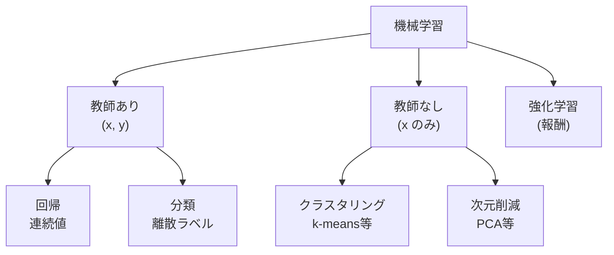

# ② 機械学習の手法

> 計画 6/27。最大配点。手法は多いが、**「何を手がかりに学ぶか（パラダイム）」「どんな仮定で線を引くか（帰納バイアス）」「どう評価するか」**の3点で整理すると暗記が激減する。

## 機械学習とは何をしているのか
機械学習は、データから入力→出力の規則性を**自動で**獲得する枠組み。古典AIが人間の書いたルールに依存したのに対し、ここではモデルがパラメータを調整して規則を「学ぶ」。学び方の違いで3つのパラダイムに分かれる。

- **教師あり**：(x, y) の正解つきデータから写像 f: x→y を学ぶ。yが連続なら**回帰**、離散なら**分類**。
- **教師なし**：xのみ。正解はなく、データに内在する構造（かたまり＝クラスタ、低次元の軸＝主成分）を見つける。
- **強化学習**：正解の代わりに**報酬**がある。エージェントが環境で行動し、累積報酬 E[Σγ^t r_t] を最大化する方策を試行錯誤で学ぶ。「今わかっている良い手を使う（活用）か、新しい手を試す（探索）か」のトレードオフが核心。

近年のLLMの土台である**自己教師あり学習**は、ラベルなしデータから「次の単語を予測」などの擬似タスクを作って教師あり的に学ぶもので、教師なしと教師ありの橋渡し的存在。

## すべてを貫く視点：バイアス-バリアンス
モデル選びの背骨になる考え方。汎化誤差は概ね **バイアス² + バリアンス + ノイズ** に分解できる。
- **高バイアス＝未学習（underfitting）**：モデルが単純すぎて、データの規則性すら捉えられない。
- **高バリアンス＝過学習（overfitting）**：複雑すぎて訓練データのノイズまで覚え、未知データで崩れる。

両者は基本トレードオフで、「モデルの複雑さ・正則化・データ量」でこのバランスを取るのが機械学習の実務。以降の手法も「バイアスを下げる系か、バリアンスを下げる系か」で見ると整理できる。

## 教師あり：主要手法と「どう線を引くか」
各手法は**帰納バイアス（どんな形の境界を好むか）**が違う。

- **線形回帰／ロジスティック回帰**：線形な関係を仮定。ロジスティック回帰は出力をシグモイドで0〜1に潰し、対数オッズを線形でモデル化する分類器。シンプルで解釈しやすいベースライン。
- **SVM**：2クラスの境界を、最も近い点（サポートベクター）との**余白＝マージンが最大**になるよう引く。余白最大化は汎化を良くする理論的裏付け（構造的リスク最小化）がある。直線で分けられない時は**カーネルトリック**で高次元へ写像し、計算は内積だけで済ませる。**ソフトマージンC**で誤分類の許容度を調整。
- **決定木**：「特徴Xがしきい値以上か？」で再帰的に分岐。分岐の良さは**ジニ不純度や情報利得（エントロピー減少）**で測る。人間が読めるのが長所だが、単体では過学習しやすい（高バリアンス）。
- **アンサンブル学習**：弱学習器を束ねて強くする。
  - **バギング（ランダムフォレスト）**：データのブートストラップ標本で多数の木を**並列**に学習し平均/多数決。各木の誤差を打ち消し合い**バリアンスを下げる**。
  - **ブースティング（AdaBoost / 勾配ブースティング / XGBoost）**：前の学習器の誤りを次が重点的に直す**直列**方式。**バイアスを下げる**。表形式データで非常に強い。
- **k-NN**：学習せず、予測時に近傍k個の多数決。単純だが次元の呪いに弱い。
- **ナイーブベイズ**：特徴の条件付き独立を仮定し、ベイズの定理で事後確率最大のクラスを選ぶ。テキスト分類に古くから有効。

## 教師なし：構造を見つける
- **k-means**：①k個の中心を置く→②各点を最近傍中心へ割当→③重心へ中心を移動、を収束まで反復（クラスタ内二乗誤差の最小化）。弱点はkの事前指定と初期値依存（k-means++で緩和）、球状クラスタの仮定。
- **階層的クラスタリング**：近いもの同士を順に併合（凝集型）し、デンドログラムで階層を可視化。kを後から決められる。
- **PCA（主成分分析）**：データの**分散が最大の方向**を順に見つけ、その軸へ射影して次元削減。実体は共分散行列の固有値分解で、大きい固有値の固有ベクトルが主成分。情報を保ちつつ圧縮でき、可視化・前処理・ノイズ除去に使う。**t-SNE/UMAP**は非線形で、局所構造を保った可視化向き（大域的な距離は保たれない点に注意）。

## 評価指標：なぜ正解率だけではダメか
**混同行列**（TP/FP/FN/TN）が出発点。正解率（Accuracy）はクラスが不均衡だと誤解を生む——「99%が陰性」のデータで全部陰性と答えれば正解率99%でも無意味。そこで目的に応じて使い分ける。

- **適合率（Precision）= TP/(TP+FP)**：陽性と判定したうち本当に陽性の割合。**偽陽性（誤検知）のコストが高い**時に重視。例：スパム判定で重要メールを誤判定したくない。
- **再現率（Recall）= TP/(TP+FN)**：実際の陽性をどれだけ拾えたか。**偽陰性（見逃し）のコストが高い**時に重視。例：がん検診で見逃しは命に関わる。
- 両者は**閾値を介してトレードオフ**：厳しく判定すれば適合率↑・再現率↓、緩めれば逆。
- **F値（F1）= 2PR/(P+R)**：適合率と再現率の調和平均。両方高くないと伸びず、不均衡データの総合指標になる。
- **ROC曲線/AUC**は閾値非依存の総合評価。不均衡が強い時は**PR-AUC**の方が頑健。

## 過学習を抑える：正則化と検証
過学習対策は「複雑さを抑える」方向に集約される。
- **正則化**：損失に重みのペナルティを足す。**L1（ラッソ）**は不要な重みを0にして特徴選択になり、**L2（リッジ）**は重みを全体的に小さく滑らかにする。両者の混合がElastic Net。
- **交差検証（k分割）**：データを分けて学習/検証を繰り返し、汎化性能を安定して見積もる。
- 前処理を全データに対して行うなどの**データリーク**は、検証を過大評価させるので要注意。

---

📝 **確認**：FP/FNのコストが非対称な実例を各1つ、対応する指標とともに／バギングとブースティングが下げるのはバイアス・バリアンスのどちら？
> カード: `ml`。
