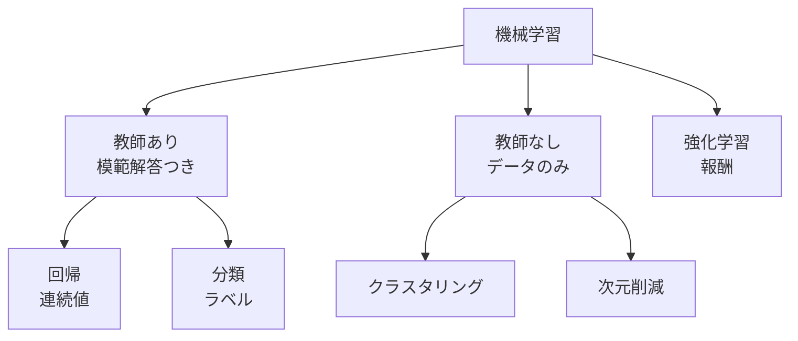

# ② 機械学習の手法

> 最大配点の分野。手法名の丸暗記ではなく、**「それぞれの手法が、何を信じてどう線を引くか」という思想の違い**の物語として読むと、選択肢が見分けられるようになる。
> ※ 末尾【出典】で評価指標・アンサンブル等を照合済み。

## 発想の転換：ルールを書くのをやめた
第2次AIブームは「専門家の知識をぜんぶ書き出す」ことに挑んで敗れた。世界は例外だらけで、人間がルールを書き切ることはできなかったのだ。そこで研究者たちは発想を逆転させる——**ルールを人が書くのではなく、大量のデータから機械自身に規則性を見つけさせればいい**。これが**機械学習**だ。プログラマが書くのは「学び方」だけで、判断の中身はデータが決める。

では機械は「何を手がかりに」学ぶのか。手がかりの種類で、機械学習は3つの流儀に分かれる。

- **教師あり学習**：問題と模範解答のペア (x, y) を渡す。答えが連続値なら**回帰**（明日の気温）、カテゴリなら**分類**（スパムか否か）。
- **教師なし学習**：データ x だけ渡して、「何か構造を見つけて」と頼む。似た者同士のかたまり（**クラスタリング**）や、データを貫く重要な軸（**次元削減**）が見つかる。
- **強化学習**：模範解答の代わりに**報酬**を渡す。エージェントが環境の中で行動し、試行錯誤で「報酬が最大になる行動方針」を学ぶ。囲碁のAlphaGoがこの系譜。**新しい手を試す「探索」と、知っている良い手を使う「活用」のバランス**が核心。

```mermaid
flowchart TD
  ML["機械学習"] --> S["教師あり<br/>模範解答つき"]
  ML --> U["教師なし<br/>データのみ"]
  ML --> R["強化学習<br/>報酬"]
  S --> Reg["回帰<br/>連続値"]
  S --> Cls["分類<br/>ラベル"]
  U --> Clu["クラスタリング"]
  U --> Dim["次元削減"]
```

ちなみに近年のLLMを支える**自己教師あり学習**は、ラベルなしの文章から「次の単語を隠して当てさせる」という擬似問題を自動で作る手法。教師なしのデータで教師ありのように学ぶ、両者の橋渡しだ。

## 最大の敵：丸暗記する優等生
機械学習の物語には、全編を通して立ちはだかる敵がいる。**過学習（オーバーフィッティング）**だ。

訓練データを丸暗記した優等生を想像してほしい。過去問は満点なのに、少しひねった初見の問題で崩れる。モデルも同じで、複雑すぎるモデルは訓練データのノイズや偶然まで「覚えて」しまい、**未知のデータで役に立たなくなる**。逆に単純すぎるモデルは、そもそも規則性を捉えられない（**未学習**）。

この2つの失敗は、**思い込みが強すぎる（バイアス大＝未学習）**か、**覚え込みすぎてブレる（バリアンス大＝過学習）**か、と言い換えられる。両方を同時にゼロにはできないトレードオフの関係にあり、モデルの複雑さで釣り合いを取る。対策の定番は：

- **正則化**：損失に「重みが大きいと罰」を加えて、モデルの自由を縛る。**L1（ラッソ）は不要な特徴の重みを完全に0にする**ので特徴選択にもなる。**L2（リッジ）は全体を満遍なく小さく**する。
- **交差検証**：データをk分割し、学習と検証を役割交代しながら繰り返して、汎化性能を安定して見積もる。
- そして何より、**データを増やす**。

以降に出てくる手法も「過学習とどう戦うか」という視点で見ると位置づけが分かる。

## 教師あり：線の引き方の思想くらべ
分類とは、データ空間に「境界線を引く」ことだ。手法ごとに、線の引き方の哲学が違う。

**線形回帰・ロジスティック回帰**は「世界は直線で説明できる」と信じる素直な手法。ロジスティック回帰は名前に反して**分類**の手法で、出力をシグモイド関数で0〜1の確率に潰す。単純ゆえに解釈しやすく、今も最初に試すベースラインだ。

**SVM（サポートベクターマシン）**は線の引き方にこだわる。「同じ分けるなら、両陣営の最前線の点（サポートベクター）から**できるだけ余裕（マージン）をとって**引くべきだ」——マージン最大化が汎化性能の裏付けになる。直線で分けられないデータは、**カーネルトリック**で高次元空間へ写して分ける。ディープラーニング以前の王者だった。

**決定木**は「特徴Xはしきい値以上か？」という質問を繰り返してデータを分ける。人間がそのまま読めるのが強みだが、質問を細かくしすぎると丸暗記に走る（過学習しやすい）。

そこで生まれたのが**アンサンブル学習**——「1本の木がダメなら、森にすればいい」。束ね方に2つの流儀がある。

- **バギング**：データをランダムに取り直して多数の木を**並列**に育て、多数決する。個々のブレが打ち消し合うので**バリアンス（ブレ）を下げる**。代表が**ランダムフォレスト**。
- **ブースティング**：弱い学習器を**直列**につなぎ、前の間違いを次が重点的に補正していく。**バイアス（思い込み）を下げる**。AdaBoost、勾配ブースティング（XGBoost・LightGBM）の系譜で、表形式データでは今もDLに劣らない実力者。

ほかに、学習せず「聞かれたら近所のk個に多数決してもらう」だけの**k-NN**、「特徴どうしは独立」とナイーブに割り切ってベイズの定理で判定する**ナイーブベイズ**（テキスト分類の定番）も押さえておく。

## 教師なし：正解なしで構造を見つける
**k-means**は「①適当にk個の中心を置く → ②各点を最寄りの中心に割り当てる → ③中心をメンバーの重心へ動かす」を繰り返すだけの素朴なクラスタリング。ただし**kは人間が先に決める**必要があり、初期値にも左右される。**階層的クラスタリング**は近いもの同士を順に併合していく方式で、樹形図（**デンドログラム**）から後でクラスタ数を決められる。

**PCA（主成分分析）**は「データが一番ばらついている方向こそ、一番情報が多い軸だ」と考えて、その軸にデータを射影して次元を減らす。可視化や前処理に使う**教師なしの次元削減**であって、分類器ではない。非線形な構造の可視化には **t-SNE / UMAP** が使われる。

## 評価：99%正解でも無意味なモデル
最後に、できたモデルをどう測るかの物語。1000人に1人しかかからない病気の検査モデルを考えてほしい。**全員に「陰性」と答えるだけのインチキモデルでも、正解率（Accuracy）は99.9%**になる。正解率は、クラスが偏ったデータでは当てにならないのだ。

そこで予測と正解の組合せを**混同行列**（TP/FP/FN/TN）に整理し、目的に合わせた指標を使う。

| 指標 | 式 | 重視する場面 |
|---|---|---|
| 正解率 Accuracy | (TP+TN)/全体 | クラスが均衡している時 |
| 適合率 Precision | TP/(TP+FP) | **誤検知(FP)が困る**：スパム判定 |
| 再現率 Recall | TP/(TP+FN) | **見逃し(FN)が困る**：がん検診 |
| F値 | PrecisionとRecallの調和平均 | 両方のバランス |

適合率と再現率は**トレードオフ**の関係にある。判定を厳しくすれば誤検知は減るが見逃しが増え、緩くすればその逆。判定しきい値に依存しない総合評価には**ROC曲線とAUC**を使う。

> 一言でいうとこの分野は、**「何を手がかりに学び（3パラダイム）、どう線を引き（各手法の思想）、丸暗記をどう防ぎ（過学習対策）、どう測るか（評価指標）」**の4幕の物語。

---

## 頻出ひっかけ
- **適合率＝TP/(TP+FP)**（誤検知に敏感）、**再現率＝TP/(TP+FN)**（見逃しに敏感）。分母を逆にしない。
- **バギング→バリアンス低減（並列）**、**ブースティング→バイアス低減（直列）**。
- **L1（ラッソ）＝重みを0にして特徴選択**、**L2（リッジ）＝重みを全体的に小さく**。
- **ロジスティック回帰は「回帰」という名前だが分類の手法**。
- **クラスタリング・PCAは教師なし**。分類・回帰は教師あり。
- **Accuracyは不均衡データで当てにならない**→Precision/Recall/F値を見る。

📝 **確認**：誤検知(FP)が困る例と見逃し(FN)が困る例を1つずつ挙げ、それぞれどの指標を見るべきか言える？　バギングとブースティングの違いを「並列/直列」「何を下げるか」で言える？

## 【出典】
- アンサンブル学習（バギング=バリアンス低減／ブースティング=バイアス低減）AIsmiley　https://aismiley.co.jp/ai_news/ensemble_learning/
- バイアスとバリアンスのトレードオフ（シス担のミカタ）　https://kobesoft.co.jp/mikata/words/ai-ml/bias-variance-tradeoff/
- 評価指標（適合率・再現率・F値）の定義は混同行列に基づく標準定義

> 暗記の反復は `ml` カード、本番形式の演習は `gtest-ml-dl` デッキで。
