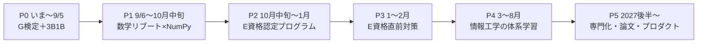

# 🗺 学習ロードマップ — AI専門への道 v1

> 最終更新: 2026-07-04。**最終ゴール: 情報工学の土台を持つAI専門人材**。
> 直近の柱: G検定 9/5 → E資格 2027年2月回（最短） → 情報工学の体系学習 → 専門化。
> 日々のタスクは「計画」タブ（日次プラン）。この文書は**方角を確認するための地図**で、各フェーズ開始2週間前に日次プランへ展開する。

---

## 1. スキルセット分析と理解の傾向

### 強み（学習の武器になるもの）
- **実装力・プロダクト志向**: アプリを作って出せる。「作ると学ぶ」が直結するタイプ（開発禁止ルールが必要なほど作りたがる）。この特性は数学・CSの学習でも**実装を伴うと定着が跳ね上がる**ことを意味する。
- **対話駆動学習が回っている**: Claudeクイズ・質問攻めの運用が習慣化済み。独学の最大の壁「質問相手がいない」が存在しない。
- **メタ認知が高い**: 「わからない」の解像度が高く（羅列だとストーリー記憶ができない、等）、学習方法そのものを改善要求できる。

### ギャップ（埋める対象）
| ギャップ | 現状 | 影響 |
|---|---|---|
| 数学の運用力 | 定義は読めるが、式変形・導出に不安 | **E資格の最大の壁**。読める→手が動くへ |
| 情報工学の体系 | 学んだが忘れている（自己申告） | 中期。AI専門の土台。E資格後に本格着手 |
| ML/DLの理論 | G検定水準の直感はあり | E資格水準（実装込み）へ引き上げが必要 |
| 学習時間 | 60分/日（固定） | 総量の制約。**詰め込み不可、継続が生命線** |

### 理解の傾向（これまでの学習で観測されたもの）
1. **ストーリー記憶型**: キーワードの羅列では定着しない。背景・因果の物語があると強い。
2. **視覚的直感を好む**: 図解・3Blue1Brown型のビジュアルが刺さる。
3. **適正難易度帯が狭い**: 易しすぎても難しすぎても弾く。「今の自分の半歩先」の管理が重要。
4. **アウトプットで固まる**: 人に説明する・Claudeに採点させる、で理解が完成する。
5. **習慣の器があれば走れる**: 毎日のチェックリスト・「取り返さない」ルールが機能している。

### → 学習設計5原則（全フェーズ共通）
- **原則1**: 新概念は「物語 → 図 → 定義 → 演習」の順で入れる。
- **原則2**: **数学は単体で学ばない**。必ずNumPy実装とペアにして「式が動く」体験に変換する。
- **原則3**: 1日1概念・60分固定・取り返さない。
- **原則4**: 2週間ごとに理解度ゲート（Claudeにテストさせ、弱点で次の2週間を補正）。
- **原則5**: 学んだものは最終的に自分のプロダクトへ接続する（Phase 5）。

---

## 2. レベル定義 — いまどこで、どこまで行くか

| Lv | 状態 | 判定基準 | 時期目標 |
|---|---|---|---|
| **Lv1** | AIリテラシー | **G検定合格** | ✅目前（2026/9） |
| **Lv2** | 理論の直感＋実装の入口 | 3B1B完走／逆伝播をNumPyで書ける／数学が「手で動く」 | 2026/10 |
| **Lv3** | DLエンジニア入口 | **E資格合格**＝主要アルゴリズムを数式と実装の両方で説明できる | 2027/2 |
| **Lv4** | CS土台を持つAIエンジニア | 情報工学の体系（アルゴリズム・OS・ネットワーク・DB）を説明・実装できる | 2027/8 |
| **Lv5** | **AI専門** | 論文を読んで実装に落とせる／専門領域を持つ／プロダクトでAIの価値を出せる | 2028〜 |

現在地: **Lv1目前**（G検定インプット完了・維持モード）。

---

## 3. 全体マップ

英語は全期間、毎日15分で並走（Phase 4以降は「AI論文・英語ドキュメントを読む」に接続して実益化する）。

---

## 4. フェーズ詳細

### P0: 〜2026/9/5 — G検定＋LLM直感（実行中）
- 内容は日次プラン v6 の通り（3B1B全7章＋G検定維持→スプリント）。
- 🎯 出口条件: G検定合格＋「NNからLLMまで」を自分の言葉で説明できる。

### P1: 9/6〜10月中旬（約6週）— E資格の前提固め【開発解禁】
E資格で問われるのは「数式を理解して**実装できる**か」。認定プログラムに入る前に、数学と実装の錆を落とす。
- **数学リブート**（原則2: 実装とペア）: 線形代数（行列積・固有値）→ 微分（連鎖律を手で追う）→ 確率（ベイズ・主要分布）。3B1B線形代数シリーズを視覚の入口に。
- **NumPyでNN実装**: 定番書『ゼロから作るDeep Learning』の流れ（パーセプトロン→活性化→逆伝播→学習）を写経ではなく「1日1部品」で自作。
- **認定プログラム選定・申込**（10月上旬まで）: 質重視・会社補助前提。候補: スキルアップAI（認定第1号）／AVILEN／キカガク。無料説明会で「質問対応の質」「修了要件の重さ」を比較して決定。
- 🎯 出口条件: 3層NNをNumPyだけで書いて MNIST 相当を学習させられる／認定プログラム申込完了。

### P2: 10月中旬〜2027/1 — 認定プログラム受講（学習の主軸を明け渡す）
- この期間は**認定プログラムのカリキュラムが主、このサイトは記録係**。60分/日の大半をプログラム消化に充てる。
- G検定の維持復習は週1・15分（ひっかけ集の流し読み）まで縮小。
- 🎯 出口条件: 修了要件クリア（＝E資格受験資格の取得）。

### P3: 2027/1〜2月下旬 — E資格直前対策
- 定番問題集（通称・黒本）＋プログラム付属の模試を回す。シラバス改定点を公式で確認。
- 🎯 出口条件: **E資格合格（Lv3）**。

### P4: 2027/3〜8月 — 情報工学の体系学習（資格は使わない）
忘れているところからの積み上げ。試験対策のオーバーヘッドなしで、**物語×実装**で学ぶ（原則1・2）。
1. **アルゴリズムとデータ構造**（3〜4月）: 計算量の感覚から。毎週1つ実装。
2. **コンピュータの仕組み**（4〜5月): CPU・メモリ・OSの役割。候補教材: Nand2Tetris（NANDゲートからテトリスまで自作する、作って学ぶ型の定番）。
3. **ネットワーク**（6月）: TCP/IP・HTTP・DNS を「パケットの旅」の物語で。
4. **データベース**（7月）: トランザクション・インデックス・正規化。
5. **並行・分散の入口**（8月）: スレッド・ロック・キュー。MLOpsの土台になる。
- 🎯 出口条件: 各分野を「人に教えられる」1枚ノートにできている（Lv4）。

### P5: 2027年後半〜 — 専門化（Lv5へ）
- **論文読解の習慣化**: Attention Is All You Need から系譜を辿る。英語学習をここに接続。
- **専門領域の選択**: LLM応用／CV／MLOps などから1つ（P4完了時点の興味で決める）。
- **プロダクト接続**: 学んだAIを自分のプロダクトに実装して出す。ポートフォリオ＝専門性の証明。
- 🎯 出口条件: 「この領域なら任せろ」と言える領域が1つ＋動くプロダクト。

---

## 5. リスクと判断ゲート

**最大のリスク: E資格2027年2月回 × 60分/日はタイトな組み合わせ。**
10月中旬〜2月下旬 ≈ 19週 × 7時間/週 ≈ **約130時間**。認定プログラムの標準受講期間は3〜6か月であり、演習・復習込みだと余裕はほぼない。そこで：

| ゲート | 時期 | 判定 | Bプラン |
|---|---|---|---|
| **G1** | 2026/10上旬 | 認定プログラム申込済み？ P1出口条件クリア？ | 未達なら P1 を2週延長し、2月回→**8月回へスライド** |
| **G2** | 2026/11末 | プログラム進捗が計画の8割以上？ | 未達なら**8月回へスライド**（違約なし・学習は継続） |
| **G3** | 2027/1中旬 | 模試で合格圏？ | 未達なら8月回へ。P4（情報工学）を先に前倒し |
| 常時 | — | 週の消化率が2週連続50%未満 | 計画を圧縮再編（内容を削る。日数は増やさない） |

**スライドは失敗ではない**。E資格は年2回あり、8月回に移すと P4（情報工学）が先に来るだけで最終ゴール（Lv5）への道は変わらない。

その他のリスク：
- **数学でつまずく** → 原則2（実装とペア）に立ち返る。式で分からなければコードで動かす。
- **燃え尽き** → 60分を死守し増やさない。日曜は15分のまま。
- **2027年のE資格日程が未発表** → 2月下旬と仮置き。**10月にJDLA公式で確定日を確認**（P1のタスクに含める）。

---

## 6. 現行成果物とのズレチェック

| # | 成果物 | 検出したズレ | 対応 |
|---|---|---|---|
| 1 | アプリの試験日カウントダウン | 7/4のまま（旧日程） | ✅ 9/5に更新済み |
| 2 | 英語の本格化日（manifest） | 7/5のまま（旧試験翌日） | ✅ 9/6に更新済み |
| 3 | 日次プラン v6 の「Phase2＝API実装」 | E資格ロードマップと不整合 | ✅ 「P1＝数学×NumPy」に書き換え済み |
| 4 | 日次プランのカバー範囲 | 9/6以降が空 | 📌 運用ルール: P1の日次展開を8月下旬に実施 |
| 5 | ⑤数理ノート | G検定水準。E資格には浅い | 📌 P1で「E資格数学ノート」を新設（このサイトに追加） |
| 6 | 暗記カード・デッキ | G検定用のみ | 対応不要（E資格演習は認定プログラム教材が担う） |
| 7 | チートシート | G検定用 | 対応不要（9/5まで現役） |
| 8 | 長期ロードマップ | 存在しなかった | ✅ 本書を新設 |

---

## 7. 出典
- E資格 概要・受験資格（認定プログラム修了が必須）: JDLA公式　https://www.jdla.org/certificate/engineer/
- 2026年E資格日程（第1回 2/20-22、第2回 8/28-30）: JDLA公式ニュース　https://www.jdla.org/news/20250919001/
- JDLA認定プログラム事業者一覧: JDLA公式　https://www.jdla.org/certificate/engineer/programs/bizlist/
- G検定 2026年開催スケジュール（第5回 9/4-6）: JDLA公式　https://www.jdla.org/news/20251008001/
- 3Blue1Brown Neural networks / Linear algebra シリーズ　https://www.3blue1brown.com/topics/neural-networks
